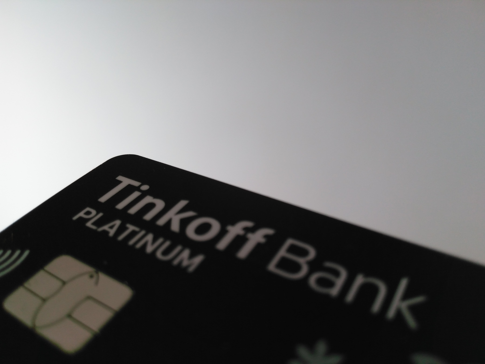

I’m a ~~brewer’s~~Tin’kov’s bank client a long time ago. But nuance is there. I’m using a debit card
only. And ’cause of that I have almost positive UX.

From the latest. I’ve blocked my card ’cause of ~~stupidity~~carelessness. After blocking the card
you can reissue it only but as the contract says reissue via user initiative costs 290₽. But for me
it was free. That is the service. In Russia. Other pros knew.

Cons. Some time ago support specialist said that I shouldn’t use rough words. WTF? Tin’kov swears.
Where is the service? I think that a business should interact with the client in its own language.
Tinkoff says that its app is the best. But that’s not true. Sberbank caught up with it. I repeat.
Sberbank. The Russian post in the bank’s world. Synonym of fucking olds, queues, and idiotic rules,
etc. And Tinkoff can’t solve all problems via the internet. In some cases, you must send documents
through regular post. I don’t know who is dumb here: law or bank. But that’s not good.

I was irritated ’cause of the “PLATINUM” inscription on my debit. WTF? This is a regular MasterCard
World card. I feel like a rapper with chicks, bucks, etc.
