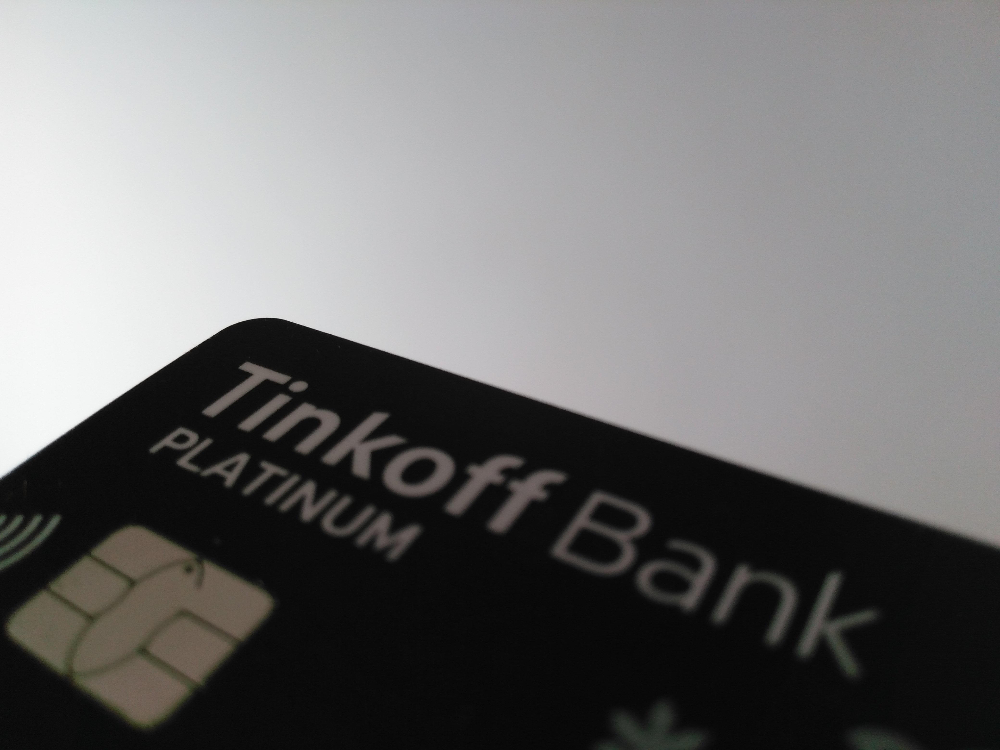

Клиентом банка от <del>пивовара</del> Тинькова являюсь очень давно. Но есть нюанс. Пользуюсь я
дебетовой картой, никаких кредитов и кредитных карт. И user experience у меня почти только
положительный.

Из последнего. Я по <del>неосторожности</del> тупости заблокировал основную карту. После этого её
остаётся только перевыпустить, а, согласно договору, перевыпуск по инициативе или вине клиента
только за 290 рублей. Мне перевыпустили бесплатно. Вот вам и сервис. В России. Остальные плюсы
известны и уже давно озвучены разными людьми.

Из минусов. Как-то сотрудник техподдержки рекомендовал мне не материться в тикете. Какого хуя? Сам
Тиньков матерится. А как же всё для клиента? Мне кажется, что с клиентом нужно общаться на его
языке. Ещё они вовсю пиарятся, что у них лучшее приложение. Но ведь это не так. Сбербанк их догнал.
Повторю ещё раз. Сбербанк. Аналог Почты России в мире банков. Синоним пиздеца и убогости, очередей,
злых ёбнутых пенсионеров, дебильных правил и другого дерьма. Ещё они не всё решают дистанционно,
иногда требуют присылать почтой документы. Не знаю, закон тут виноват или банк, но осадок остался.
Ещё на дебетке жутко бесит надпись «PLATINUM». Нахуя эти понты (причём лживые), когда карта всего
лишь обычная MasterCard World? Напрягает. Чувствуешь себя уёбком на старом жигуле, зато с
прямотоком, дешёвым буфером и литьём.
