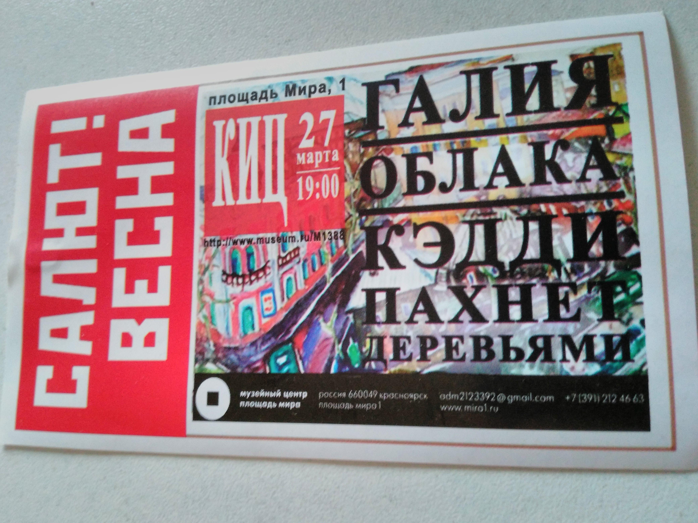
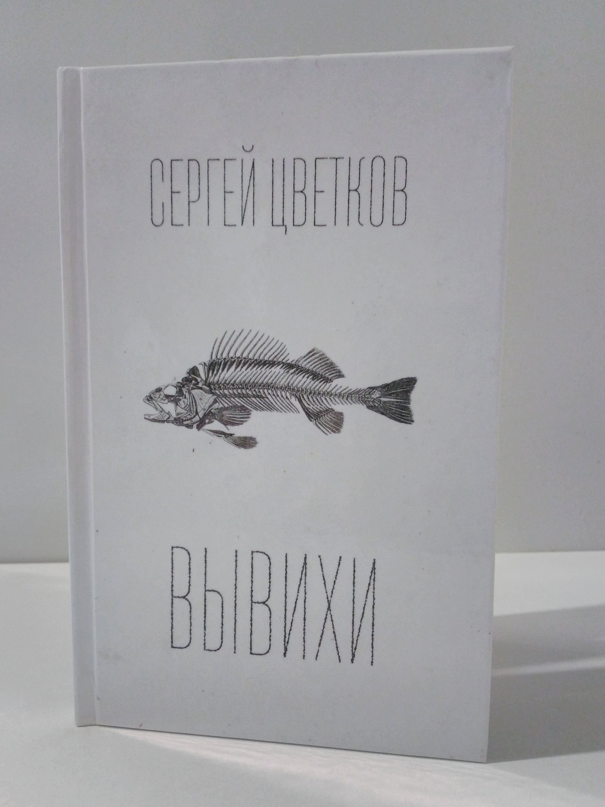

Came to KIC… and didn’t find the fucking entrance (I was looking for about 5 minutes around the
building). Obviously, their entrance was at the front but in this case, it was in the backyard. Some
nonsense. The event was started from lyrics reading. And it was like
[№ 5](https://en.wikipedia.org/wiki/No._5,_1948). Sets of words where the meaning can see only
people with high‐level Zen. For example:

> And I liked everything. The poems got into the soul, made me think, and just reminded me what love
> is and the fact that we are all equal. Some authors directly transferred fire to just their eyes,
> and when they began to read, my heart stopped, and then it beat sharply because the words reached
> the very depths of me. Special thanks to the vocals, very strong voices, sonorous, bright, and
> clear. and finally, we come to the end. who stayed in recent times could fully experience the
> songs of their beloved Galina and go dancing the waltz or everyone’s favorite jazz or blues ❤
> everything was great!) Thank you for a fabulous evening ✨ You make people believe in life, and
> this is a lot, thanks to everyone who was on stage ✨

Scary men… ‘[Another team](https://vk.com/wall-115786413_36)’ is closer to me:

> I should say you… It was a rape… Guys, are you listening to yourself??? Poets – everyone to the
> factory!!! Have you been told that poetry is not just a set of words? There, as it were, the
> meaning should at least slip through! Trees – there are no petitions to you (there is to sound
> engineer). Clouds!!! Vocals -??? Whaaat was that?. I will not say anything to everyone who was
> there further, because it was unbearable. Sorry for being rude. But the listener must also be
> respected. And that was a shame.

Although I liked it and remembered lyrics about women and fire by the first poet that was presented
as ‘fashion‐guru’ :) After all of the poets for whom I went to the concert, I’ve seen them – CSLT.
CSLT burned, of course. If the audience applauded the poets for the sake of decency, then for them
for 100%. Good job. By the way like on [Andrew’s](https://vk.com/a_shevelev) lection bassist was the
loudest. :D And I bought his book:

I should say about the sound. Almost at the beginning of the concert, one of the poets dropped the
microphone on the floor and later it died while performing a song by the CSLT band. On the stage,
there was a wire to one of the microphones, and when one of the musicians touched it, this
immediately became known to everyone in the hall. The sound engineer screwed it up as he rehearsed
it! Squeaks for the whole hall, then the voices are too loud, then too quiet, then a mad echo, then
some kind of interference… Awful! After CSLT was finished the performance I left the hall. Before
leaving, I went to the toilet to piss and he welcomed me with the smell of piss and shit. Cultural
fucking institution, shit, and their toilet wasn’t be cleaned. And I had to leave through the back
door.
