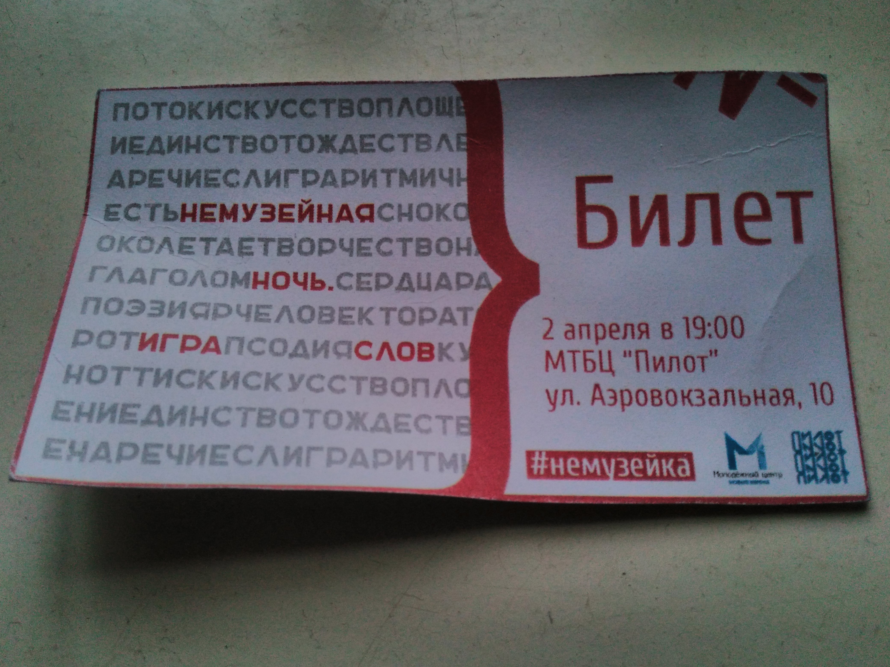

Well, the impressions are settled, I can write.

I visited ‘Pilot’ for the first time since it was a terrible place. Naturally, for the CSLT. But
also I’ve seen the bad poets. At the first time, the lyrics were really bad. I even experienced
vicarious embarrassment. But then they became quite good and even funny. CSLT pleased, as always
(only 2 times listened to their lives, and already say “always” :D). I heard a new song, but again I
did not understand the words. :( The entertainer was impressed by the number of instruments in the
band (which is, that is). Here is a quote from the band’s SMM manager:

> We had 2 guitars, 75 noisemakers, 5 harmonicas, half of the suitcase shakers, and a whole galaxy
> of flutes of all types and colors and also ukulele, agogo, chalumeau, cajon, handmade quray, and 2
> piano accordions. Not that we needed all that for the performance, but once you get smelled like
> trees it becomes too difficult to stop. The only thing that caused us was the didgeridoo. Nothing
> in the world is more helpless, irresponsible, and vicious than didgeridoo playing. We knew that
> sooner or later we would switch to this rubbish.

After the concert, I learned that the CSLT already has their own small fandom and I’m in it.
