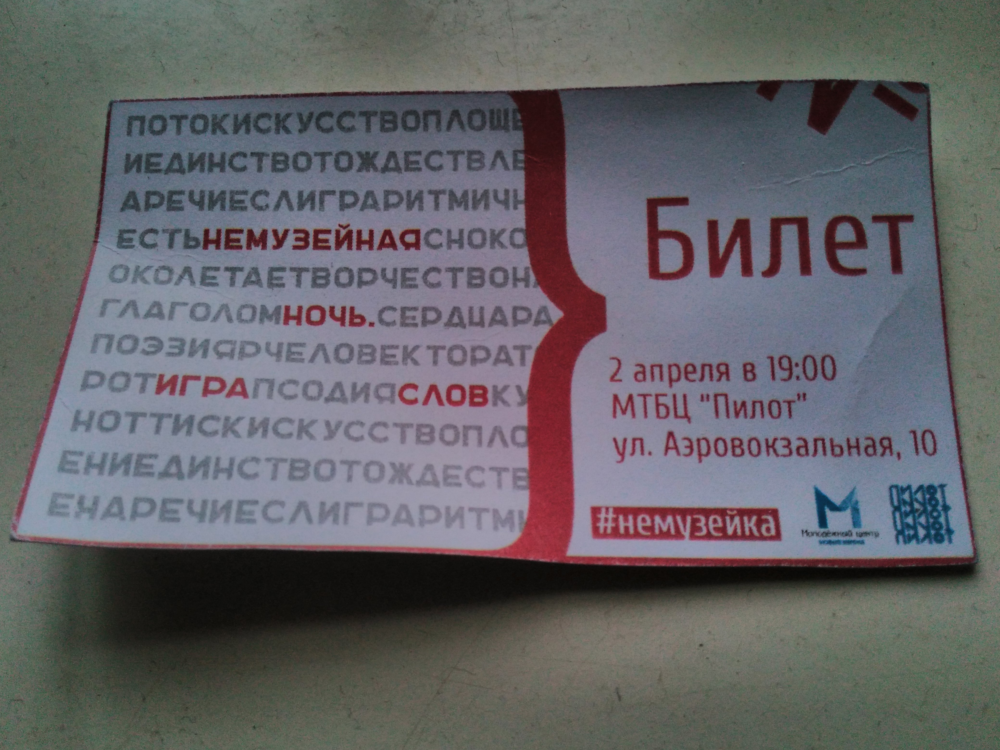

Ну, впечатления устаканились, можно и&nbsp;написать.

Впервые после того, как он&nbsp;был ужасной рыгаловкой, посетил Пилот. Естественно, ради КПД.
Но&nbsp;зацепил ещё и&nbsp;плохих поэтов. Сначала стихи действительно были <nobr>какие-то</nobr>
<del>говно</del> плохие. Я&nbsp;даже испытал испанский стыд. Но&nbsp;потом они преобразились
во&nbsp;вполне себе хорошие и, даже, весёлые. КПД порадовали, как всегда (<nobr>всего-то</nobr> 2
раза слушал вживую, а&nbsp;уже &laquo;всегдакаю&raquo; :D). Услышал новую песню, но&nbsp;опять
не&nbsp;понял слов. :( Конферансье был впечатлён количеством инструментов группы (что есть,
то&nbsp;есть). Тут к&nbsp;месту цитата <nobr>SMM-щика</nobr> группы:

> У&nbsp;нас было 2 гитары, 75 шумелок, 5 губных гармошек, полчемодана шейкеров и&nbsp;целое
> множество флейт всех сортов и&nbsp;расцветок, а&nbsp;так&nbsp;же укулеле, агого, шалюмо, ящик
> кахона, мастеровой курай и&nbsp;2 аккордеона. Не&nbsp;то&nbsp;чтобы это был необходимый запас для
> выступления, но&nbsp;если начал пахнуть деревьями, становится сложно остановиться. Единственное,
> что вызывало у&nbsp;нас опасение&nbsp;&mdash; это диджериду. Ничто в&nbsp;мире не&nbsp;бывает
> более беспомощным, безответственным и&nbsp;порочным, чем игра на&nbsp;диджериду. Мы&nbsp;знали,
> что рано или поздно мы&nbsp;перейдем и&nbsp;на&nbsp;эту дрянь.

После концерта я&nbsp;узнал, что у&nbsp;КПДшников уже есть свой небольшой фэндом, что радует, куда
вхожу и&nbsp;я.
