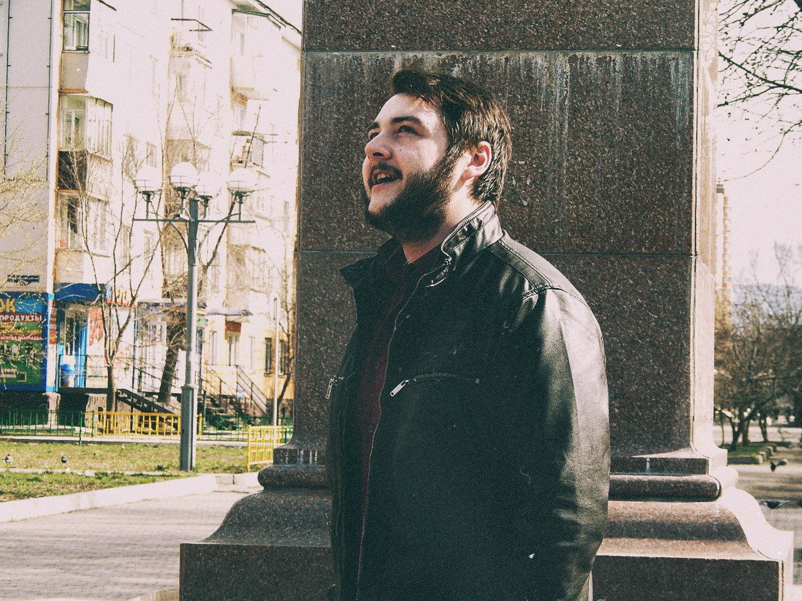
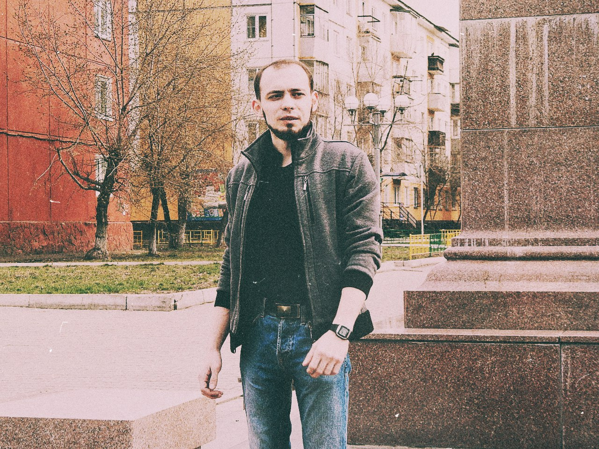

24 апреля 2016 года в&nbsp;Красноярске прошли традиционные (первый раз за&nbsp;пять лет, блядь!)
&laquo;<a href="https://vk.com/mayakkrsk">Маяковские чтения</a>&raquo;, посвящённые одноимённому
поэту. Людей было мало, ведь поэзия никому не&nbsp;нужна. Больше всего мероприятие было похоже
на&nbsp;междусобойчик для фил- и&nbsp;литфаков местных шараг.&nbsp;Читали охуенно вот эти люди
(фотографии маленького хромого человека с&nbsp;мощным голосом не&nbsp;нашёл):

Не&nbsp;берусь судить её, дабы не&nbsp;быть предвзятым (стоит отметить, что хотя&nbsp;бы было
слышно, в&nbsp;отличие от&nbsp;остальных баб, которые вообще полушёпотом себе под нос
<nobr>что-то</nobr> бурчали):

Остальные читали хуёво. Самое интересное, что им&nbsp;было категорически не&nbsp;стыдно за&nbsp;своё
чтение&hellip; Стыдно было мне (испанский во&nbsp;всей красе, да!). Периодически веселил толпу алкаш
с&nbsp;двумя собачками на&nbsp;одном поводке (слева внизу даже видно &laquo;кусок&raquo; собаки):

Но&nbsp;гвоздём программы стал случайный (хотя я&nbsp;сомневаюсь) прохожий, которого я&nbsp;назвал
&laquo;батей&raquo;. Он&nbsp;как торнадо забежал в&nbsp;круг зрителей и&nbsp;чтецов, сказал
<nobr>какие-то</nobr> слова и&nbsp;начал орать стихи. Орал он&nbsp;их&nbsp;крайне охуительно:
с&nbsp;надрывом в&nbsp;голосе, летящими слюнями, горящим взглядом глаза в&nbsp;глаза своим
&laquo;жертвам&raquo;, с&nbsp;бутылкой <nobr>какого-то</nobr> пойла в&nbsp;руке (или нет,
я&nbsp;не&nbsp;запомнил, <nobr>т. к.</nobr> охуел от&nbsp;такого внезапного и&nbsp;крутого чтения!),
<nobr>какой-то</nobr> жестикуляцией (местами даже &laquo;атакующей&raquo;). Прокричав
&laquo;стих&raquo;, собрался было уходить и&nbsp;кинул нам всем &laquo;Пойду пить дальше!&raquo;,
чем сорвал овации. Но&nbsp;потом вернулся и&nbsp;дал нам ещё стихов. Только ради него стоило
посетить эти чтения. Только ради него. Только. Ради. Него. Очень круто!

Закончилось всё матерными стихами про &laquo;любовь как кусок пизды&raquo;, &laquo;хуй из&nbsp;уст
в&nbsp;уста&raquo; и&nbsp;политическими про &laquo;это Путин виноват&raquo;. Чтения определённо
удались. Придётся идти ещё.
