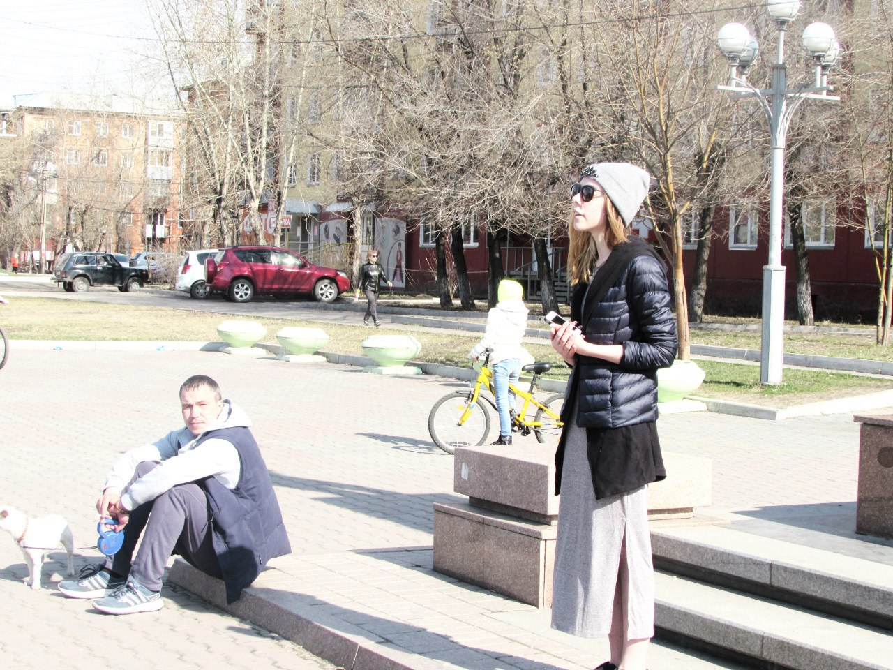

24th April 2016, Krasnoyarsk hosted the traditional (for the first time in five years, fuck!)
‘[Mayakovsky Readings](https://vk.com/mayakkrsk)’ dedicated to the poet with the same name. There were few people
because no one needed poetry. Most of all, the event was like a tet‐a‐tet for the philology and literary faculty of
local universities. These people read awesome (I couldn’t find pictures of a small lame man with a powerful voice):

I don’t presume to judge her, so as not to be biased (it is worth noting that at least she was audible, unlike other
women, who generally muttered something in a half‐whisper under their breath):

The rest read like shit. The most interesting thing is that they were absolutely not ashamed o their reading… I was
ashamed (vicarious embarrassment in all its glory, yes!). Periodically, a drunk with two dogs on one leash amused the
crowd (at the bottom left, you can even see a ‘piece of a dog):

But the highlight of the program was a casual (although I doubt) passer‐by whom I called ‘dad’. He, like a tornado, ran
into the circle of spectators and readers, said some words, and began to shout poetry. He yelled them extremely awesome:
with anguish in his voice, flying saliva, a burning eye‐to‐eye sight of his ‘victims’, with a bottle of some sort of
drink in his hand (or not, I didn’t remember, because I was fucked from a sudden and abrupt reading!), some
gesticulation (sometimes even “attacking”). Having shouted “verse”, he was about to leave and shout to us all “I”ll go
drink further!’ But then he came back and gave us more poetry. It was worth attending these readings only for his sake.
Just for his sake. Only. For. His. Sake. Very cool!

Readings were ended with obscene verses about ‘love is like a piece of pussy’, ‘dick from mouth to mouth’ and political
about ‘It’s Putin’s fault.’ The readings were definitely successful. We’ll have to go some more.
