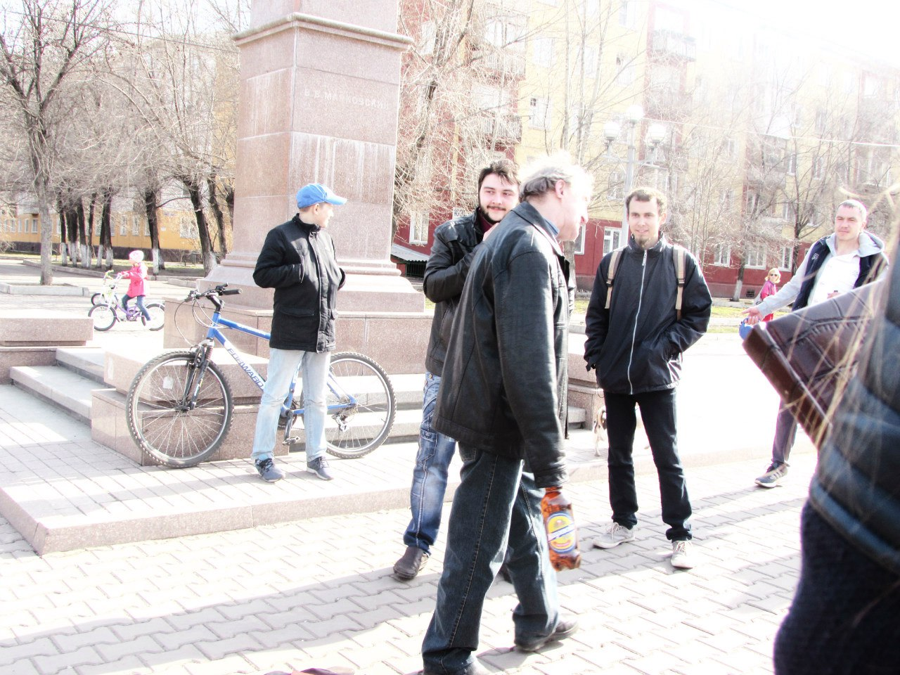
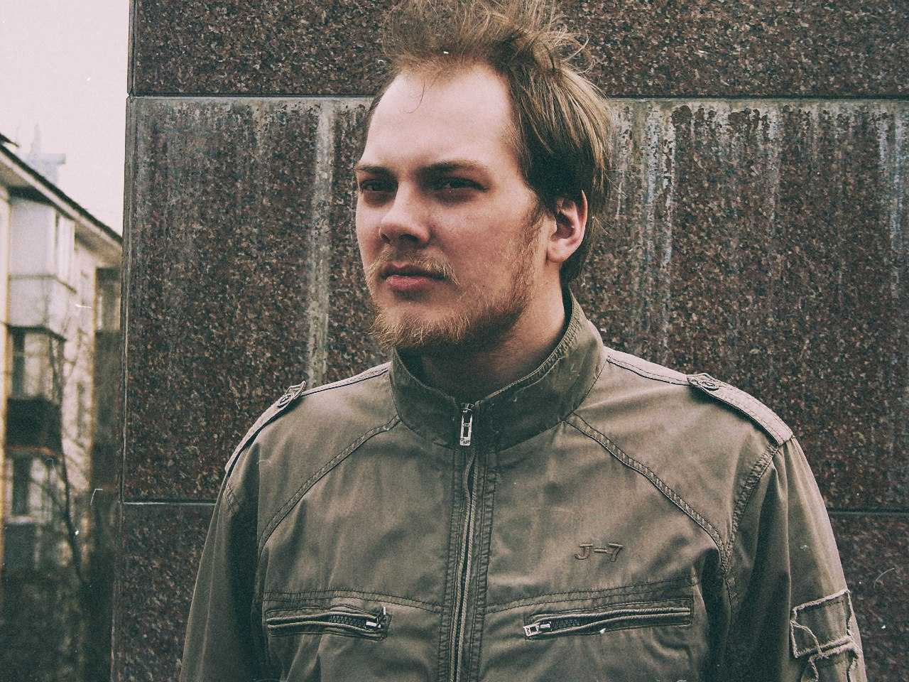
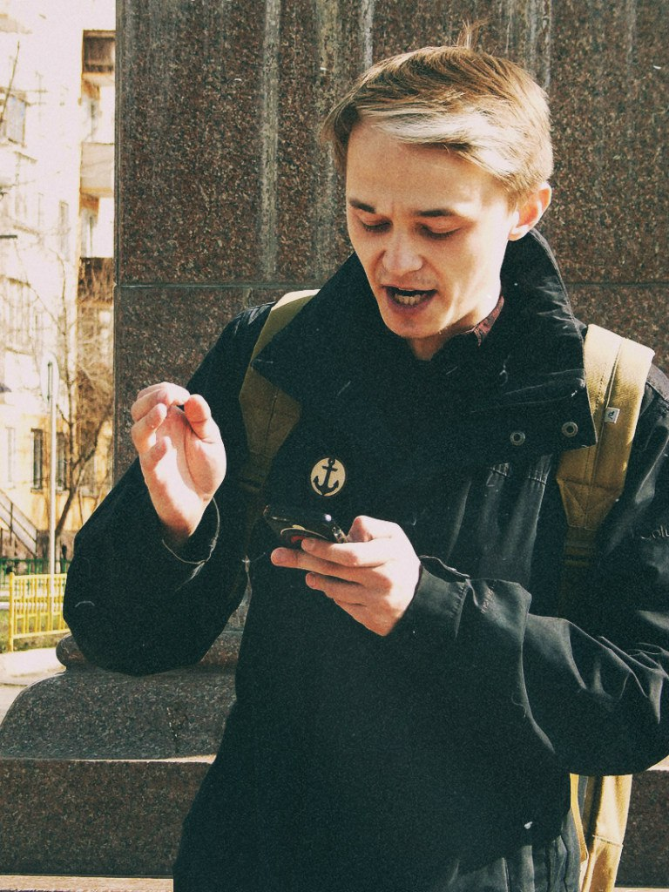

24 апреля 2016 года в Красноярске прошли традиционные (первый раз за пять лет, блядь!)
«[Маяковские чтения](https://vk.com/mayakkrsk)», посвящённые одноимённому поэту. Людей было мало,
ведь поэзия никому не нужна. Больше всего мероприятие было похоже на междусобойчик для фил‐ и
литфаков местных шараг. Читали охуенно вот эти люди (фотографии маленького хромого человека с мощным
голосом не нашёл):

Не берусь судить её, дабы не быть предвзятым (стоит отметить, что хотя бы было слышно, в отличие от
остальных баб, которые вообще полушёпотом себе под нос что‐то бурчали):

Остальные читали хуёво. Самое интересное, что им было категорически не стыдно за своё чтение… Стыдно
было мне (испанский во всей красе, да!). Периодически веселил толпу алкаш с двумя собачками на одном
поводке (слева внизу даже видно «кусок» собаки):

Но гвоздём программы стал случайный (хотя я сомневаюсь) прохожий, которого я назвал «батей». Он как
торнадо забежал в круг зрителей и чтецов, сказал какие‐то слова и начал орать стихи. Орал он их
крайне охуительно: с надрывом в голосе, летящими слюнями, горящим взглядом глаза в глаза своим
«жертвам», с бутылкой какого‐то пойла в руке (или нет, я не запомнил, т. к. охуел от такого
внезапного и крутого чтения!), какой‐то жестикуляцией (местами даже «атакующей»). Прокричав «стих»,
собрался было уходить и кинул нам всем «Пойду пить дальше!», чем сорвал овации. Но потом вернулся и
дал нам ещё стихов. Только ради него стоило посетить эти чтения. Только ради него. Только. Ради.
Него. Очень круто!

Закончилось всё матерными стихами про «любовь как кусок пизды», «хуй из уст в уста» и политическими
про «это Путин виноват». Чтения определённо удались. Придётся идти ещё.
