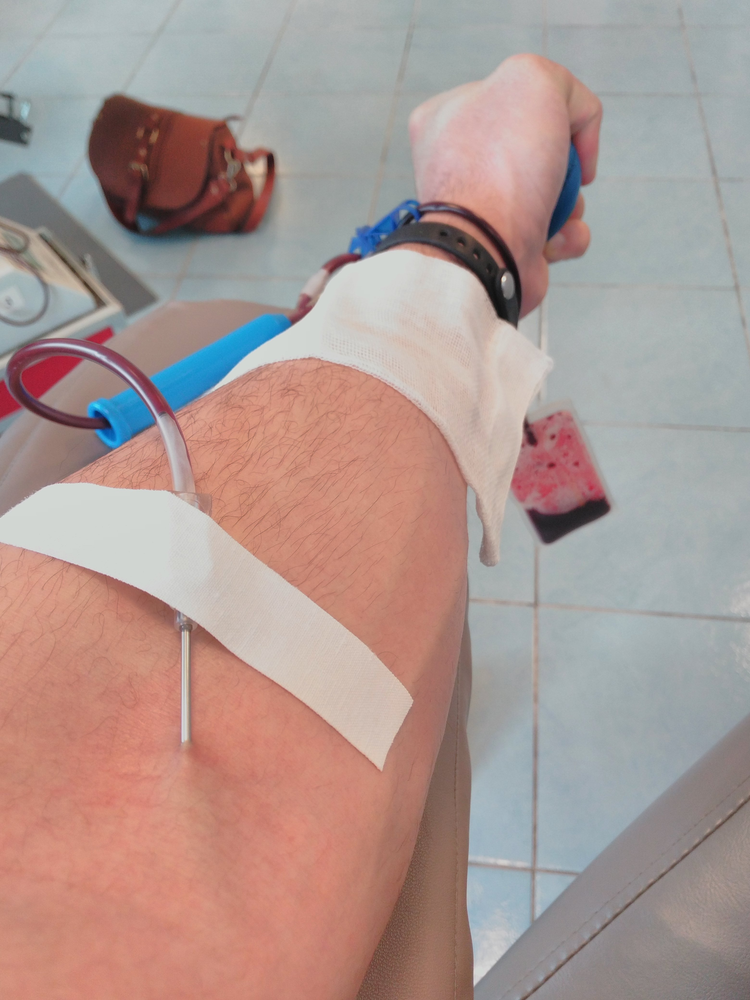

After a break of 9 months of ~~pregnancy~~ laziness, I resumed ‘flow’ donation (every 2 months). I don’t know what I’m
doing this for? It is not paid, I don’t give a shit to help someone, It is not rewarded with enough food, it hurts, the
Honorary Donor is not honorable at all. The tangible advantages are a free blood test for various diseases and a free
day off from work on the day of blood donation + an additional day off. Intangible – training the body to produce blood.
Here’s the process:

Blood is taken twice: for a preliminary analysis (with a thin needle) and, in fact, the blood donation itself is already
from the other hand (pictured). Today they gave me a SURPRISE: while peeling off the plaster that holds the needle in
the vein, the nurse jerked the needle very rudely, somehow at an angle. I was almost pissed, how disgusting and painful
in a new way. And here’s the result:

Yes, too little. You can’t pay bills with donation “salary” (hello, “Senseless”). P. S. I’m not a loader, I’m a
photoblogger.
