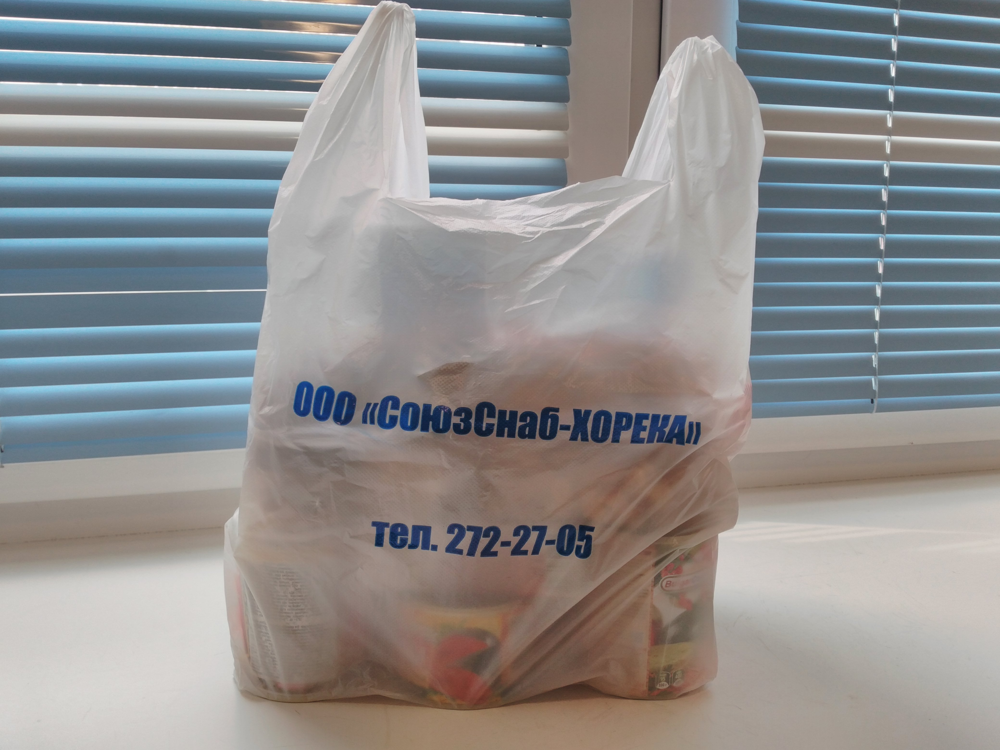

После перерыва в 9 месяцев ~~беременности~~ лени возобновил «поточное» донорство (каждые 2 месяца).
Сам не знаю, для чего это делаю? Денег не платят, на помощь кому‐то мне насрать, еды мало дают,
больно, «Почётный донор» вообще не почётен. Осязаемые плюсы — это бесплатный анализ крови на
разнообразные болезни и освобождение от работы в день кроводачи + дополнительный выходной.
Неосязаемый — тренировка организма в выработке крови. Вот процесс:

Кровь два раза берут: для предварительного анализа (тонкой иглой) и, собственно, сама кроводача уже
с другой руки (на фото). Сегодня мне сделали СЮРПРИЗ: отклеивая пластырь, что держит иглу в вене,
медсестра очень грубо рванула иглу, как‐то под углом. Чуть не обоссался, как это противно и
по‐новому больно. А вот результат:

Да, немного. Хуй‐то получится на это прожить (привет, «Без чувств»). P. S. Я не грузчик, я
фотоблогер.
