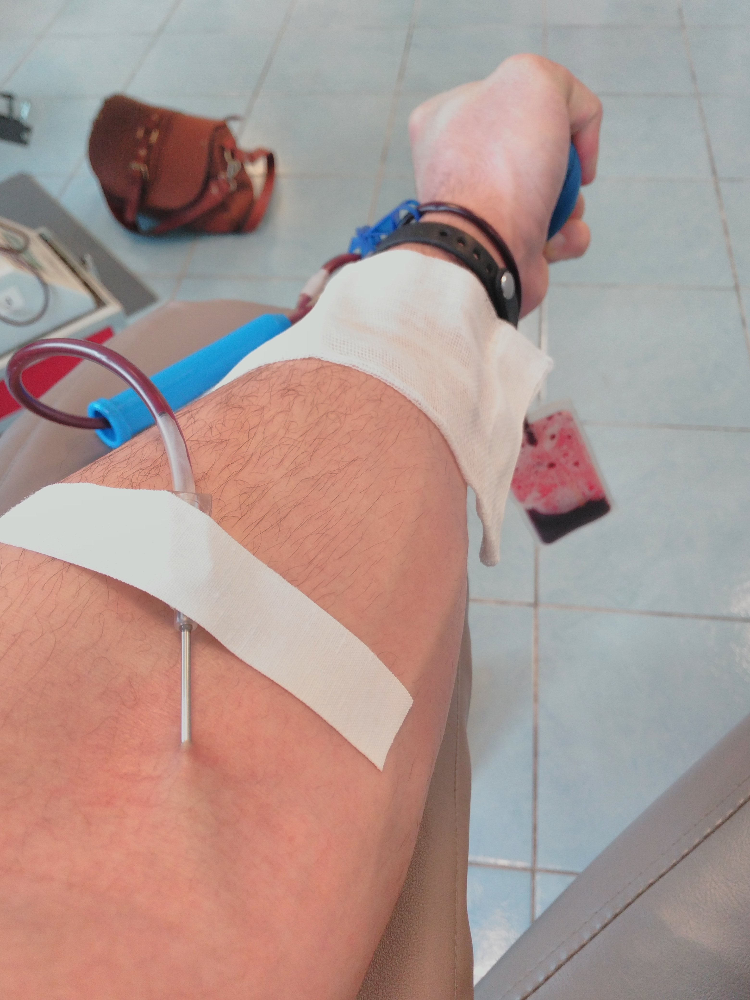

После перерыва в&nbsp;9&nbsp;месяцев ~~беременности~~ лени возобновил &laquo;поточное&raquo;
донорство (каждые 2 месяца). Сам не&nbsp;знаю, для чего это делаю? Денег не&nbsp;платят,
на&nbsp;помощь <nobr>кому-то</nobr> мне насрать, еды мало дают, больно, &laquo;Почётный донор&raquo;
вообще не&nbsp;почётен. Осязаемые плюсы&nbsp;&mdash; это бесплатный анализ крови
на&nbsp;разнообразные болезни и&nbsp;освобождение от&nbsp;работы в&nbsp;день кроводачи +
дополнительный выходной. Неосязаемый&nbsp;&mdash; тренировка организма в&nbsp;выработке крови. Вот
процесс:

Кровь два раза берут: для предварительного анализа (тонкой иглой) и, собственно, сама кроводача уже
с&nbsp;другой руки (на&nbsp;фото). Сегодня мне сделали СЮРПРИЗ: отклеивая пластырь, что держит иглу
в&nbsp;вене, медсестра очень грубо рванула иглу, <nobr>как-то</nobr> под углом. Чуть
не&nbsp;обоссался, как это противно и&nbsp;<nobr>по-новому</nobr> больно. А&nbsp;вот результат:

Да, немного. <nobr>Хуй-то</nobr> получится на&nbsp;это прожить (привет, &laquo;Без чувств&raquo;).
<nobr>P. S.</nobr> Я&nbsp;не&nbsp;грузчик, я&nbsp;фотоблогер.
