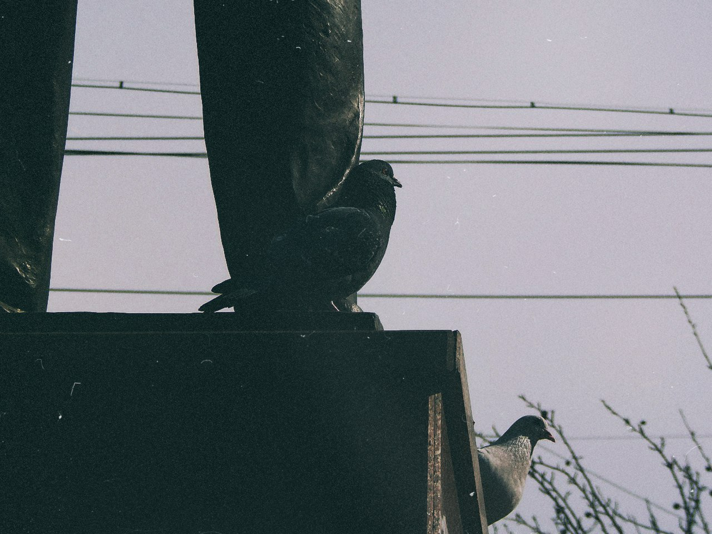

 Вот и&nbsp;прошли вновь
&laquo;воскрешённые&raquo; чтения, вторые уже. В&nbsp;этот раз они прошли&hellip; Они прошли. Дождь
шёл, хуле. Вместо чтений получился квартирник на&nbsp;площади Маяковского у&nbsp;памятника
ему&nbsp;же под дождём. 
Думаю, на&nbsp;такой случай организаторам нужно носить в&nbsp;кармане бюстик Маяковского, ставить
его там, где условия комфортнее и&nbsp;проводить чтения там (альтернативная точка сбора
на&nbsp;случай плохой погоды). Идея с&nbsp;&laquo;отметками&raquo; лучших хороша,
но&nbsp;я&nbsp;сразу помыслил: &laquo;А&nbsp;как&nbsp;же худшие? Их&nbsp;тоже надо отмечать&raquo;.
В&nbsp;этот раз всех было слышно, что, безусловно, заебись! Вот и&nbsp;причина, почему мне
на&nbsp;первом мероприятии понравились далеко не&nbsp;все чтецы: их&nbsp;не&nbsp;было слышно.

<nobr>Всё-таки</nobr> такое мероприятие должно быть многочисленнее.

Update: Самым хуёвым чтецам надо дарить книжку Донцовой.
