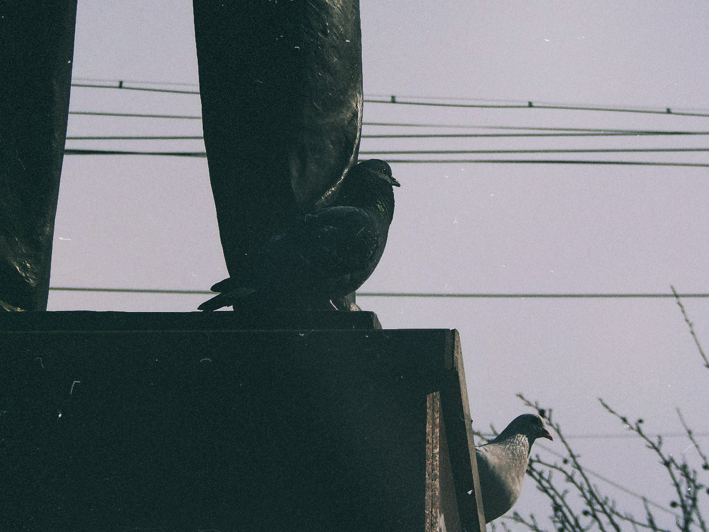
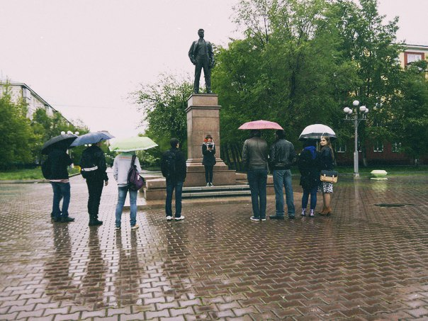

Вот и прошли вновь «воскрешённые» чтения, вторые уже. В этот раз они прошли… Они прошли. Дождь шёл,
хуле. Вместо чтений получился квартирник на площади Маяковского у памятника ему же под дождём.

Думаю, на такой случай организаторам нужно носить в кармане бюстик Маяковского, ставить его там, где
условия комфортнее и проводить чтения там (альтернативная точка сбора на случай плохой погоды). Идея
с «отметками» лучших хороша, но я сразу помыслил: «А как же худшие? Их тоже надо отмечать». В этот
раз всех было слышно, что, безусловно, заебись! Вот и причина, почему мне на первом мероприятии
понравились далеко не все чтецы: их не было слышно.

Всё‐таки такое мероприятие должно быть многочисленнее.

Update: Самым хуёвым чтецам надо дарить книжку Донцовой.
