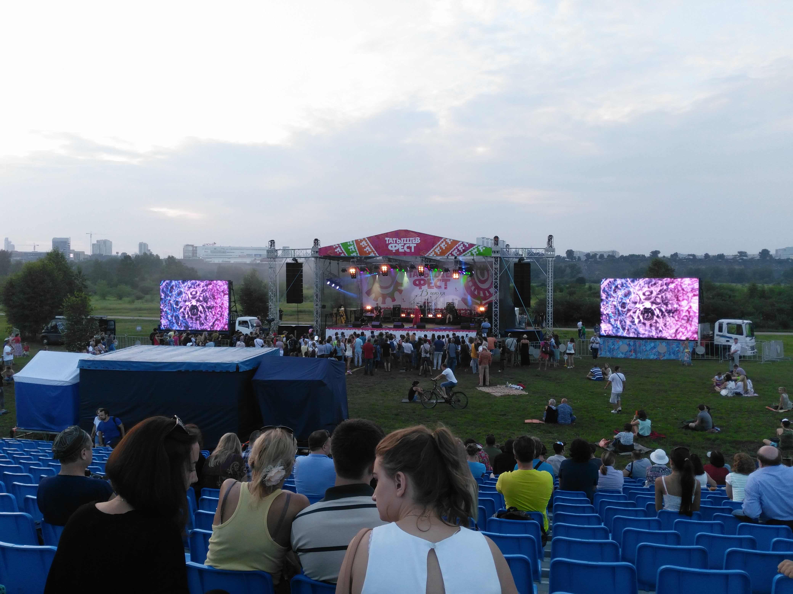
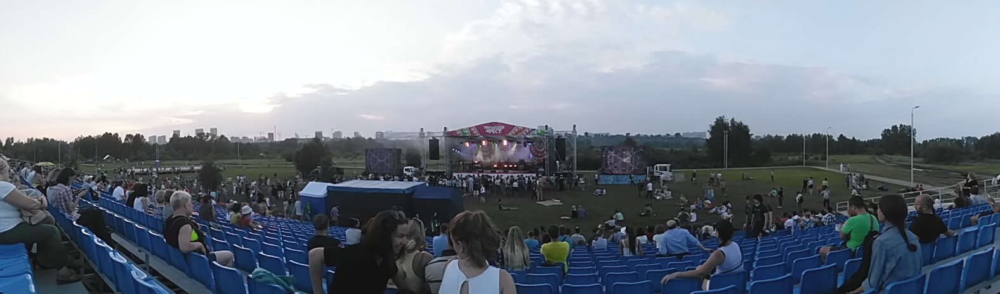

On July 13th, I attended this event because of some two. I liked it, but it’s a shame that there
were few people. Probably because the advertising for the event was absolutely shitty. I found out
about the fest by chance, that’s why I went.

‘The last shilling’ was played as cool as always. With dances and round dances. Only a little
(frankly, there was little of everything).

To my shame, I firstly heard Inna Zhelannaya and Sergei Starostin. Starostin is not for me, but
Zhelannaya rolled in. Very reminiscent of ‘Orange Blossom’. The lullaby in her performance is
suitable only for mortification. :D The drive is incredible, of course.‘

Also because of my love for throat singing, I liked ‘Irenek Khan’. It’s a pity, you can’t listen to
it at home, there are too few recordings on the net.

I even made a panorama. This is how depressingly, in general, the cool event passed.

