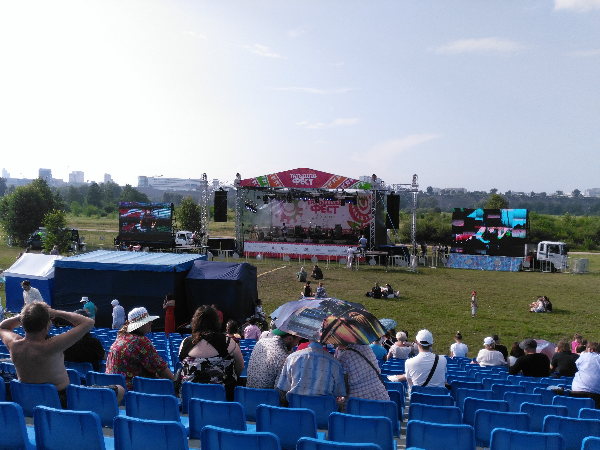
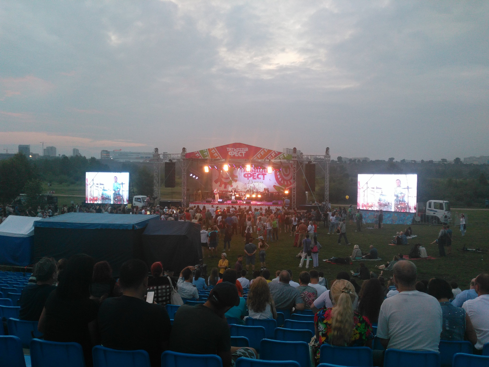

13 июля посетил из-за неких двоих это мероприятие. Понравилось, только вот обидно, что было мало
людей. Наверное, потому, что рекламы у мероприятия было совсем нихуя. Я о фесте узнал случайно,
потому и сходил.

Последний шиллинг как всегда отыграли охуенно и весело. С плясками и хороводами. Только мало
(откровенно говоря, мало было всего).

К своему стыду, впервые услышал Инну Желанную и Сергея Старостина. Старостин не по мне, а вот
Желанная вкатила. Очень напомнила Orange Blossom. Колыбельная в её исполнении годится только
умертвления. :D Драйв невероятный, конечно.

Ещё из‐за моей любви к горловому пению понравились «Иренек Хан». Жаль, нельзя послушать дома, больно
уж мало записей в сети.

Даже панораму сделал. Вот так уныло прошло заебательское, в общем‐то, мероприятие.

