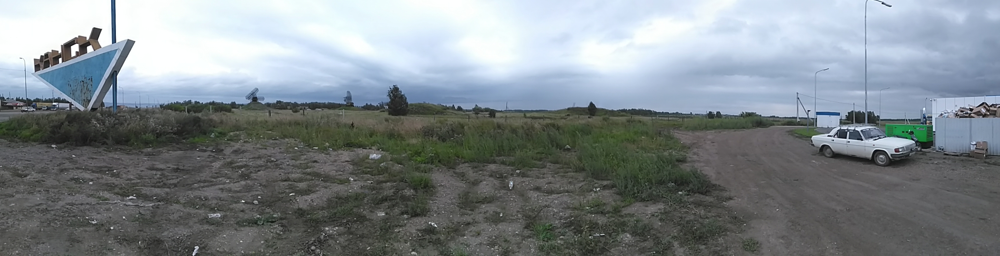

24 августа 2016 года отправился автостопом на Байкал… Хотя, лучше загляну чуть дальше в прошлое.

23 августа вечером начал собираться в свой первый автостоп. В свой школьный рюкзак, который со мною
уже более 10 лет, упихал спальник, снаружи в его нижние петли укрутил коврик и за них же зацепил
«ЛЕНТАчную» палатку за почти 800 ₽, дальше, напихал вовнутрь всякой мелочи, типа
паст‐щёток‐контейнеровдлялинз‐зарядок‐чутьчутьеды‐шапкутрусыноски. Мой максимализм был придушен
проСВЕТлением благоразумия и я взял с собою карту с 0 ₽ на счету и 125 ₽ наличными.

24 августа. Утро на нервах, ведь я ссусь выходить из своей «теплицы» (еду куда‐то, почти без денег,
один, впервые лет за 10 или больше). Поел, собрался, попрощался и пошёл. На улице был дождь, что
хорошо сочеталось с дырками в подошвах кед. Естественно, сразу промокли ноги, на что я
неблагоразумно положил хуй. На остановке около дома решил воспользоваться деньгами, чтобы сэкономить
время, и доехал за 22 рубля до трассы на Канск.

А теперь самое оно!

Не проголосовав и 10 минут, добился успеха: меня подобрал грузовик. Водитель был из «среднеазиат» и
по‐русски ~~говорил~~ пытался говорить. Подвёз до Берёзовки и пожелал счастливого пути. Даже имён не
узнали друг у друга. Дальше минут 5 ожидания и вторая машина: Александр на универсале. Подвёз до
Кускунки, если память не подводит. Следом минут 15 ожидания и «Женя» на Ларгусе. Он оказался
автостопщиком из 90‐х, отошедшим уже «от дел». Объехал чуть ли не весь бСССР. Узнав, что я на
Байкал, сказал что‐то типа: «Блядь, ты там ОХУЕЕШЬ! Вода чистейшая, природа заебись. Это не
объяснить, просто поверь». Настоятельно советовал побывать на тундровых озёрах и вообще поездить по
стране. Доехали до Уяра почти. Потом БЕЗЫМЯННЫЙ УГРЮМЫЙ ВОДИТЕЛЬ на классике. Назвать имя отказался
и сказал, что поедем молча. Под старою магнитолою валялись кассеты (кассеты, блядь! В 2016 году!) из
серии «шансон, волчья доля, жизнь моя жестянка». До Канска доехали в тишине.

Дальше автостоп перестал работать и я пошёл пешком от самой стелы «Канск».

В итоге я затупил и прошёл объездную. Пришлось пройти насквозь весь город. Заняло это полдня и два
мозоля. Канск оказался ужасной дырой: обосранная деревня, которая почему‐то носит статус «город». На
выезде из города стоял около часа, хотя место было хорошим! Потом остановился грузовик, что довёз
Тайшета. Интересно, что водитель проехал мимо меня, понял, что забыл в магазине в Канске товар,
который купил и съездил обратно, а потом на обратном пути увидел меня второй раз и, тогда уже,
подобрал. К Тайшету приехали почти в 21 час и было уже темно. Я принял решение заночевать и поставил
под деревьями около трассы палатку. Первая ночёвка!..
