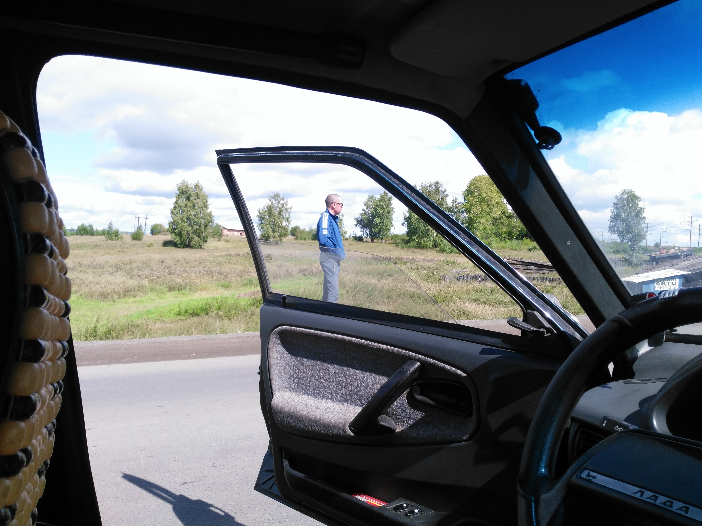
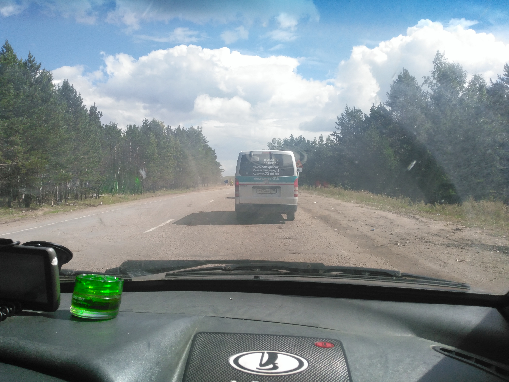

<nobr>25-го</nobr> встал рано утром. Пожрал, собрался, вышел на&nbsp;трассу. Минут 5
и&nbsp;я&nbsp;в&nbsp;тачке. Работник СИЗО довёз до&nbsp;ближайшего кафе, где должны были быть
дальнобойщики, которых там не&nbsp;оказалось и&nbsp;кафе было закрыто. &laquo;Похуй,
заполируем!&raquo; Пошёл пешком в&nbsp;поисках удобного места для стопа (был в&nbsp;самом низу
склона). Прошёл до&nbsp;вершины и&nbsp;охуел от&nbsp;того, что в&nbsp;удобном месте автостоп
ни&nbsp;черта не&nbsp;попёр. Не&nbsp;выдержал и&nbsp;пошёл дальше. Дойдя до&nbsp;развязки, прошёл
чуть дальше неё и&nbsp;там машина остановилась в&nbsp;течение 10&nbsp;минут: ВАЗ 2109.

Водителем оказался бурят Николай (на&nbsp;фотографии он), который покинул родной
<nobr>Улан-Удэ</nobr> для жизни в, тогда ещё, Свердловске. Он&nbsp;ехал обратно в&nbsp;столицу
Бурятии к&nbsp;родителям. Меня удивило, что он&nbsp;не&nbsp;пил
и&nbsp;не&nbsp;ел&nbsp;в&nbsp;течение всего дня поездки, чтобы &laquo;не&nbsp;выходить
в&nbsp;туалет&raquo;. Проехал с&nbsp;ним до&nbsp;самого Иркутска почти не&nbsp;разговаривая.
В&nbsp;пути сделал широко известное в&nbsp;узких кругах фото:

Дальше&nbsp;&mdash; Иркутск.

В&nbsp;городе определил через 2ГИС, что мне нужен автобус 13. На&nbsp;остановке спросил незнакомку
(красивую, кстати, потому и&nbsp;подошёл), всё&nbsp;ли правильно я&nbsp;решил
с&nbsp;<nobr>13-м</nobr> маршрутом. Ответила, что да, всё верно и&nbsp;что она тоже едет
к&nbsp;северному выезду из&nbsp;города. В&nbsp;итоге разговорились и&nbsp;поехали вместе. Имя
её&nbsp;&mdash; Наталья. После беседы со&nbsp;мною, узнав, что сорвался автостопом, уволившись
с&nbsp;работы и&nbsp;бросив нахуй другую, тоже загорелась, но&nbsp;заметила, что семья с&nbsp;тремя
детьми и&nbsp;мужем помешает этому (я&nbsp;же удивился, естественно, про себя, какая красивая баба
в&nbsp;возрасте да&nbsp;ещё родившая трёх детей). Также заметил приличное число женщин
в&nbsp;хиджабах (в&nbsp;Красноярске такой хуйни нет). Выйдя из&nbsp;автобуса (кстати, она
за&nbsp;меня заплатила за&nbsp;проезд 15 &#8381;), дошли до&nbsp;её работы, где я&nbsp;пополнил
запас воды и&nbsp;на&nbsp;прощание она мне дала немного свежих овощей, которые были употреблены
в&nbsp;ближайшие полчаса.

<nobr>Чуть-чуть</nobr> пройдя пешком я&nbsp;очутился в&nbsp;начале Качугского тракта. Я&nbsp;просто
шёл вдоль разъёбанной обочины, когда впереди остановился автомобиль (а&nbsp;ведь
я&nbsp;не&nbsp;голосовал) и&nbsp;включил &laquo;аварийку&raquo;. Закралась мысль, что это
за&nbsp;мною. Поравнялся с&nbsp;водительскою дверью и&nbsp;убедился, что это так. Поехали
до&nbsp;деревни Оёк. Имя водителя, к&nbsp;сожалению, забыл. Вышел на&nbsp;пересечении трассы
<nobr>Р-418</nobr> и&nbsp;дороги на&nbsp;вышеупомянутый Оёк. Времени было уже 20 часов
с&nbsp;лишним. Попробовал голосовать и&nbsp;успеха не&nbsp;добился. Поставил палатку метрах
в&nbsp;50 от&nbsp;трассы. Перед сном, как дельный, выставил на&nbsp;просушку кеды, стельки
и&nbsp;носки. Пожрал, почитал и&hellip; Началась вторая ночёвка и&nbsp;последняя на&nbsp;пути
к&nbsp;фестивалю.
