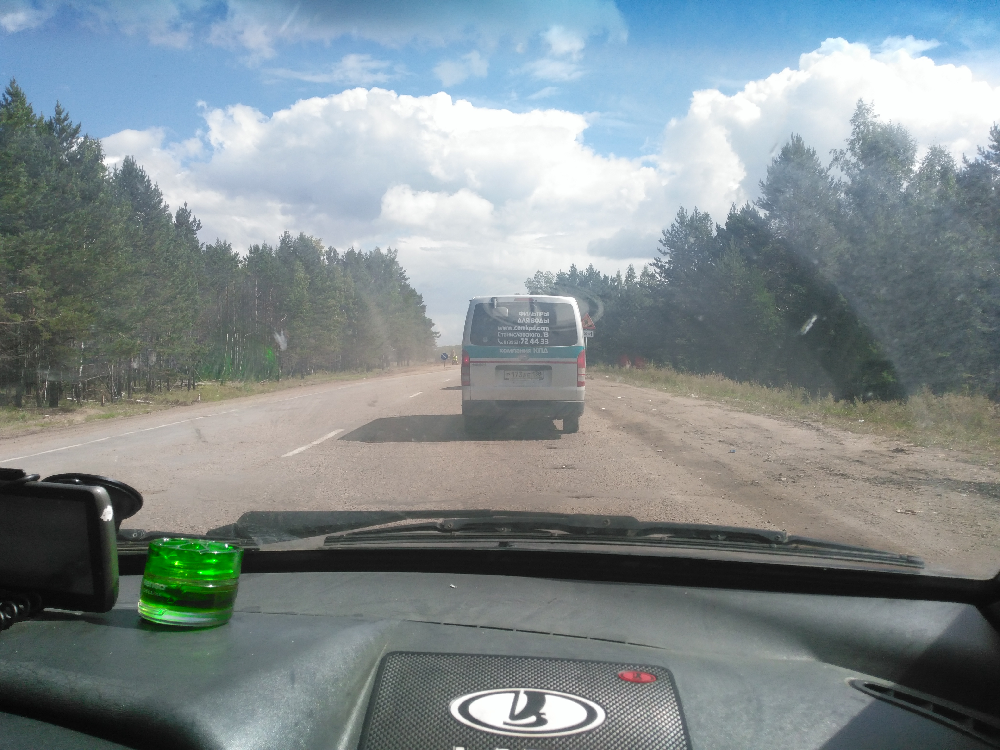

On the 25th I got up early in the morning. I ate, packed my stuff, went out on the track. 5 minutes
and I’m in a car. An employee of the pre‐trial detention center drove to the nearest cafe, where
truckers were supposed to be, who was not there and the cafe was closed. “Fuck, polish!” I went on
foot in search of a convenient place to stop (I was at the very bottom of the slope). I walked to
the top and got crazy because the hitchhiking didn’t flop a damn thing in a convenient place. I
could not stand it and go on. Having reached the junction, I walked a little further than it, and
there the car stopped for 10 minutes: VAZ‐2109.

The driver was Buryat Nikolai (he is in the photo), who left his native Ulan‐Ude to Sverdlovsk. He
drove back to the capital of Buryatia to visit his parents. I was surprised that he did not drink or
eat during the entire day of the trip so as not to ‘go to the toilet’. I drove with him to Irkutsk
almost without speaking. On the way, I took a photo widely known in narrow circles:

Further – Irkutsk.

In the city, I determined through 2GIS that I needed bus 13. At the bus stop, I asked a stranger
(she was beautiful, by the way, that’s why I came up) if I had decided everything correctly with
route 13. She replied that yes, everything is correct and that she was going to the northern exit of
the city too. As a result, we got to talking and drove off together. Her name is Natalia. After
talking with me, she knew that I hitchhiked, quit my job, and left the fuck out another, she also
caught fire, but noticed that a family with three children and a husband would interfere with this
(I was surprised, of course, about myself, what a beautiful woman at the age who still gave birth
three children). I also noticed a decent number of women in hijabs (there is no such shit in
Krasnoyarsk). Leaving the bus (by the way, she paid 15 rubles for the fare for me), we reached her
work, where I refilled the water supply and in parting, she gave me some fresh vegetables, which
were eaten in the next half hour.

Having walked a little, I found myself at the beginning of the Kachugsky tract. I was just walking
along the broken curb when the car in front of me stopped (and I didn’t vote) and turned on the
emergency. I thought that was for me. I came up to the driver’s door and made sure that it was. We
went to the village of Oyok. Unfortunately, I forgot the driver’s name. I got out at the
intersection of the P‐418 highway and the road to the mentioned Oyok. The time was already over 20
hours. I tried to vote and did not succeed. I put up a tent about 50 meters from the road. Before
going to bed I put on my sneakers, and socks to dry. I ate, read and… The second night began and the
last one was on the way to the festival.
