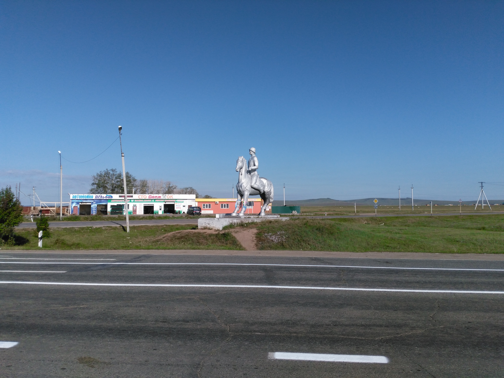
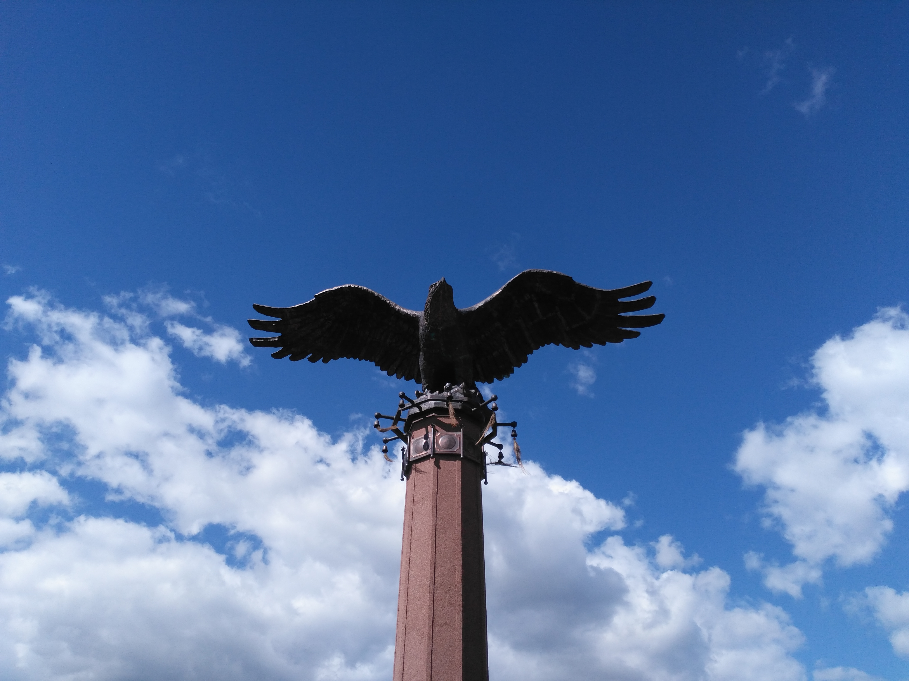

Ранним утром 26 числа проснулся от холода! Я был одет во всю свою одежду, спал в спальнике в позе
эмбриона на коврике в палатке. И один хуй замёрз! В палатке было очень влажно. И ПИЗДЕЦ ДУБАК!
Кое‐как заставил себя вылезти из спальника и пожрать. В процессе согрелся чуть‐чуть. Начав покидать
палатку, взял в руки обувь и вознегодовалохуел! Она была мокрее, чем я положил её сушиться. Но
делать нехуй, одел всё мокрым. Собрался и вышел стопить. Стоп не попёр от слова «совсем». Пришлось
пройти вдоль трассы до остановки, где уже я поехал «перебежками» до самых Ользонов. За это время
ехал с военным, на микрике, с таксистом, на «хлебовозке». Тут я покинул «хлебовозку» в первый раз:

В Ользонах «хлебовозка» остановилась второй раз. Водитель — Александр. С ним ехали до Еланцов. Сам
он с Ангарска. Именно в пути на его машине я понял, что я на Байкале. Природа изменилась, начались
частые перевалы, красивые виды сверху на долины. Машина была в возрасте и при езде в гору ощутимо
«охуевала» от таких нагрузок. Интересно, что Саня тоже охуевал. Сказал, что в этих местах в первый
раз лет за восемь, хоть и живёт рядом. Прям как я до этого путешествия. Обмолвился, что наконец‐то
нашёл себе пихточку для посадки рядом с домом (их там было просто завались вокруг, разных форм,
размеров и расцветок). Надеюсь, что он всё‐таки приехал туда ещё раз и забрал к себе желаемое
дерево. В Еланцах я переоделся за каким‐то забором, поменял, наконец‐то, носки (ну, как поменял,
одел снизу мокрых и дырявых сухие недырявые), «попушистил» корову, которая испугалась и рванула от
меня в дыру в заборе. Стоп снова начал угасать. Пришлось идти дальше пешком. И тут снова
«хлебовозка». «Бог троицу любит», — сказал «старый знакомый». Довёз меня до выезда из Еланцов, но
это, увы, не помогло. Пришлось несколько километров пиздовать пешком из‐за никакой
«останавливаемости». В пути были примерно такие пейзажи:

Спустя час с лишним остановились две машины. В них было 6 баб разного возраста. Не успев сесть в
первую из машин, услышал, как с переднего сиденья раздалось: «А у нас‐то мужик есть!» Они ехали до
Ольхона, а меня высадили в Сахюрте (который местные называют «МРС»), где и проходил фестиваль. В
пути много «лялякали», остановились около памятника с орлом:

Неприятно удивила дорога до такого популярного места, как Ольхон: грунтовка, очень некомфортная,
пыльная и ухабная. Пиздец, короче.

В МРСе я просто поднялся вверх от трассы и очутился на базе отдыха, где на входе никого не было,
хотя вход платный. Зашёл в КПДшную юрту. На часах было что‐то около 15 часов. Мой первый автостоп на
≈1300 км. занял ≈2,5 дня. Было здорово!
