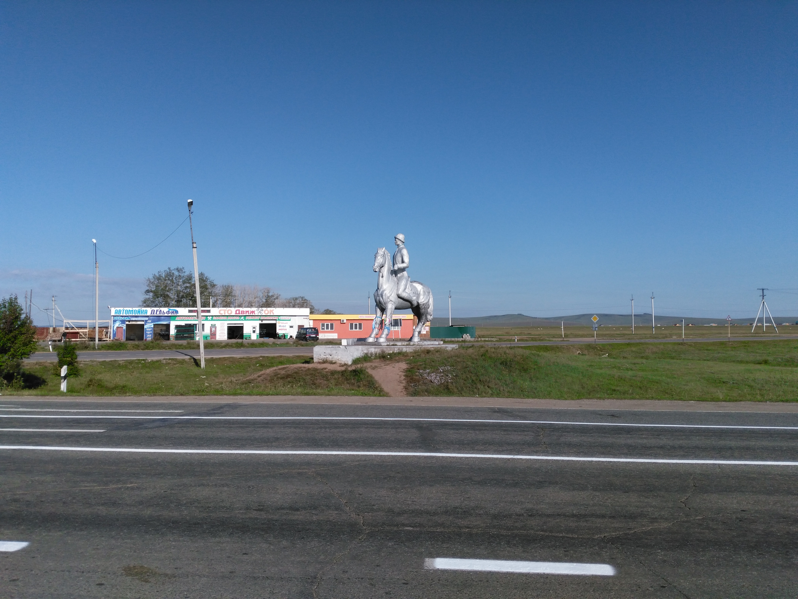
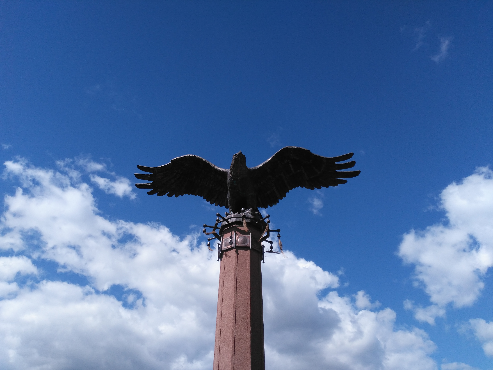

In the early morning of the 26th, I woke up ’cause of cold! I was dressed in all my clothes,
sleeping in a sleeping bag in a fetal position on a rug in a tent. And one I’m frozen! The tent was
very humid. AND VERY COLD! Somehow I forced myself to get out of the sleeping bag and ate. In the
process, I warmed up a little. Starting to leave the tent, I took my shoes in my hands and was
surprised! It was wetter than I put it to dry. I dressed everything wet. Packed my stuff and went
out hitchhiking. The hitchhiking was unsuccessful from the word “absolutely”. I had to walk along
the road to a stop, where I went from time to time to the Olzons. During this time I was traveling
with a military man, in a wagon, with a taxi driver, in a “bread truck”. Then I left the “bread
truck” for the first time:

In Olzony the “bread truck” stopped for the second time. The driver was Alexander. We rode with him
to Elancy. He is from Angarsk. It was on the way in his car I understood that I was at Lake Baikal.
Nature has changed, frequent passes began, beautiful views from above to the valleys. The car was
aged and, when driving uphill, noticeably “fucked up” from such loads. Interestingly, Sanya was
fucked up too. He said that in these places for the first time in eight years, although he lives
nearby. Just like me before this trip. He mentioned that he had finally found a tree for planting
near the house (there were different shapes, sizes, and colors). I hope that he still came there
again and took the desired tree with him. In Elancy, I changed my clothes behind a fence, finally
changed my socks (well I put on wet and leaky dry ones below), pet a cow, which got scared and
jerked away from me into a hole in the fence. The stop began unsuccessfully again. I had to go
further on foot. And here again the “bread truck”. “God loves the Trinity, ” said the “old
acquaintance”. He took me to the departure from Elancy, but, alas, it did not help. I had to walk
for several kilometers because of no “stoppability”. On the way, there were approximately the
following landscapes:

More than an hour later, two cars stopped. There were 6 women of different ages in them. Not having
time to get into the first of the cars, I heard from the front seat: “And we have a man!” They drove
to Olkhon, and they dropped me off in Sakhyurt (which the locals call “MRS”), where the festival was
held. On the way there were a lot of chatting, we stopped near the monument with the eagle:

The road to such a popular place as Olkhon was unpleasantly surprised: a dirt road, very
uncomfortable, dusty and bumpy.

In MRS, I just climbed up from the highway and found myself at a recreation center, where there was
no one at the entrance, although the entrance was paid. I went to the CSLT’s yurt. The clock was
about 15 o’clock. My first hitchhiking at ≈1300 km. took ≈2.5 days. It was great!
