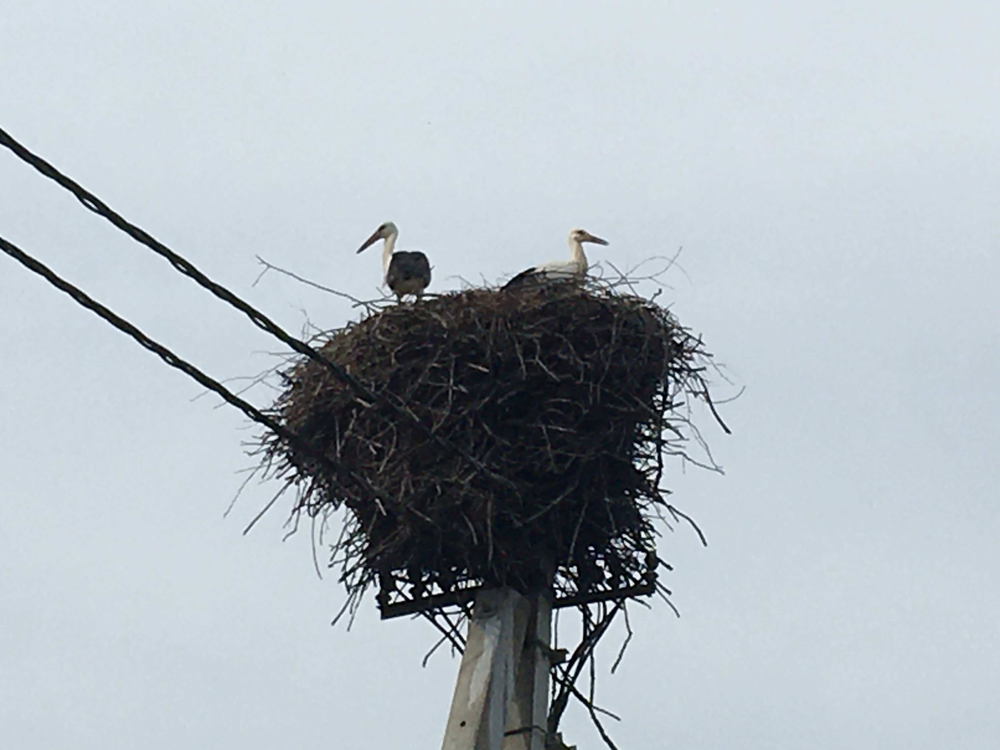
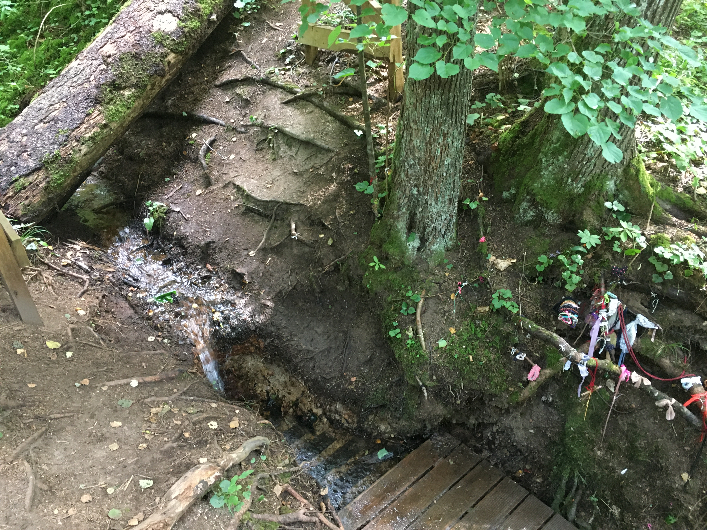
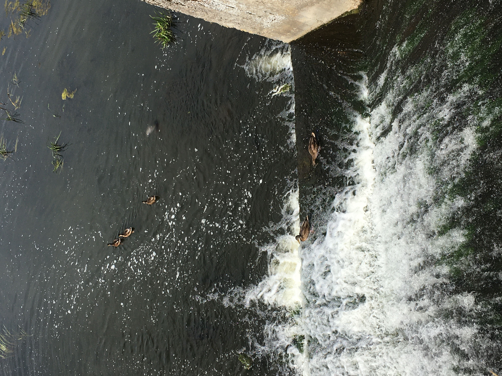
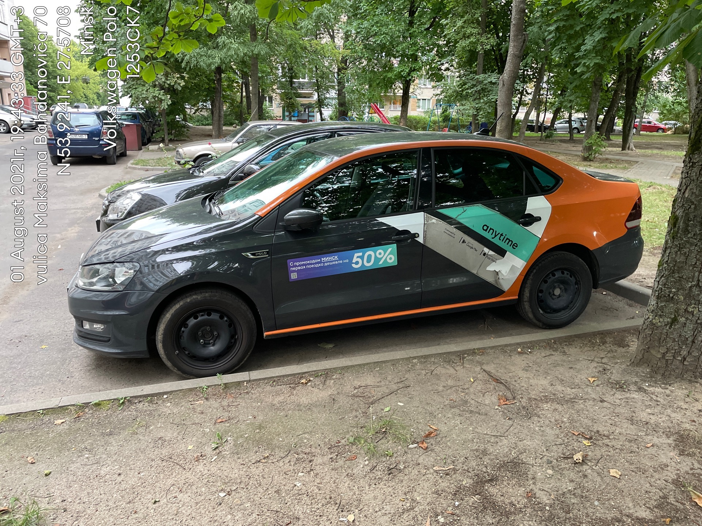

Once upon a time, I saw an
<a href="https://realt.onliner.by/2021/06/12/20-krutyx-mest-dlya-progulok">article</a> at Onliner.
And now, more than a month later, I’m ready to look at places from that article.

I used the car sharing by <a href="https://any-time.by">Anytime</a> as a transport. From the
beginning, I blunted that the car starts only after the start of the sharing (support explained
everything). On the way, I saw a white stork’s nest with chicks.

The first point of the way was the ‘Holy Krinitsy’. I have already traveled here on a bike (where I
made figure-eight on the back wheel and bent the derailleur hanger) but the trip was much nicer on
the car ~~whoever doubted~~. It is quiet, calm in the krinitsy, but everything is spoiled by human
garbage and fallen trees that blocked the trail. The water tastes like iron.

Вторая точка — «Водохранилище Удранка». Площадь его довольно скромная, но искупаться хватило. Дамбу
засрали битыми бутылками.

Номер три — «Гидропарк санатория „Сосновый бор“». А вот тут даже есть какая‐то инфраструктура:
лодочный прокат, островки с мангалами и беседками. Беседки, кстати, бесплатны для клиентов санатория
и платны для всех остальных. Но, как обычно в Беларуси, захочешь заплатить — ~~хуй тебе~~ не найдёшь
куда. Больше всего радости доставляют подвесные мостики да утки, коих здесь много.

Четыре — «Балластный карьер» возле Вязынки. Приехал, да не попал через КПП. ШТОШ…

Номер пять — «Быстротоки у Заславля». Путь сюда заканчивается весьма длинной паршивой грунтовкой. Но
зато потом можно посмотреть сами быстротоки и живность, что тут обитает: множество лягушек, что
расскакиваются из‐под ног, да какие‐то мелкие рыбы.

6 — «Юцковские родники». Почти то же самое, что номер один, но вода гораздо более приятная: без
металла во вкусе, чуть сладковатая. И гораздо больше точек для набора воды. А ещё атмосфера тут
гораздо таинственнее — овраг, прохлада, тропа среди нависающих деревьев…

И этого хватило на весь день.

В общем, я нашёл, чем заполнять выходные ~~не всё же за компом сидеть~~. Удивило меня в себе то, что
понравилось водить, особенно на шоссе. Очень расслабляет (почти как ETS2), но ведь опасно на
скорости 120. Не водил я лет 10 ~~вообще не водил, кроме как на экзамене~~, а за день езды вполне
привык (пришлось, правда, прилагу для ПДД с неделю использовать, чтобы освежить знания). От аренды
впечатление портит завязка на мобильное приложение, да такая, что без интернета машину не закрыть и
не открыть. Пришлось звонить в поддержку для этого около «криниц». И апп странно работает с 3G
интернетомv— вообще не работает. ~~Не читал, но~~ осуждаю.

В итоге за день накатал 266 км, истратив пол‐бака. Потратил на всё ≈$42 (105.34 BYN). В планах
посетить остальные места.

А ещё меня удивило, что смог машину задним ходом нормально запарковать с первого раза. Не ожидал от
себя.

