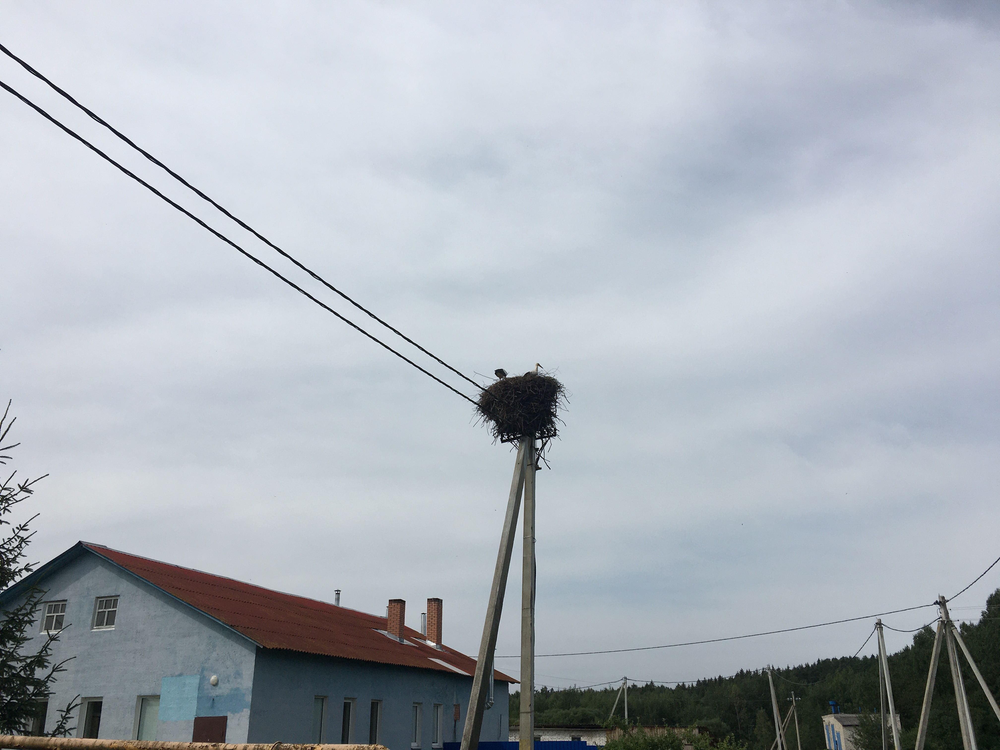
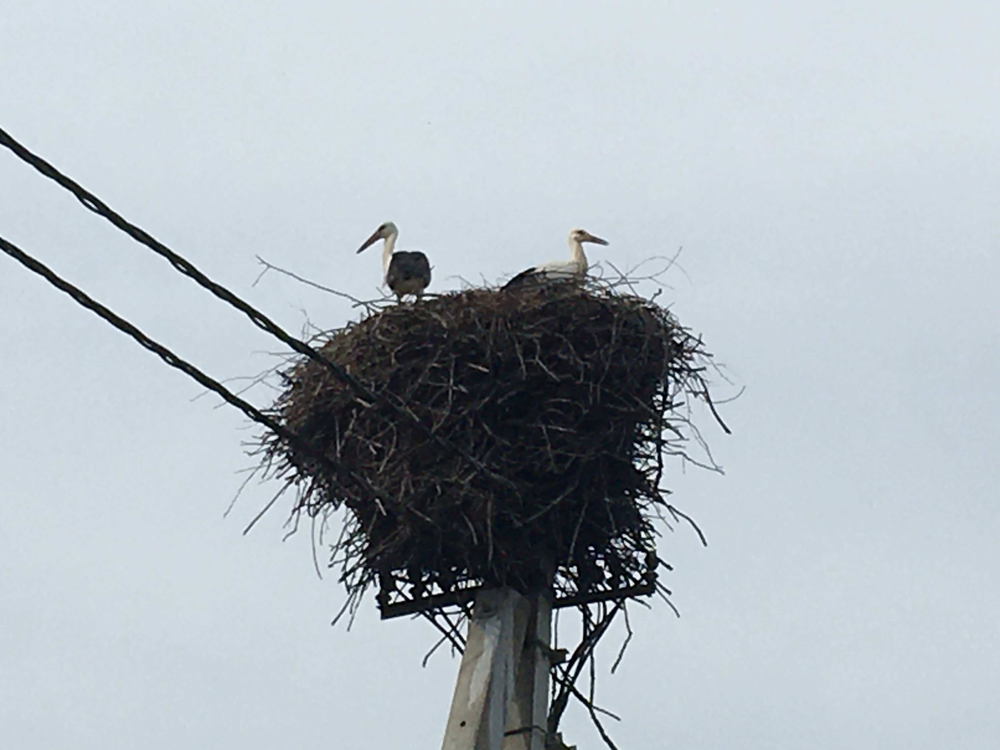
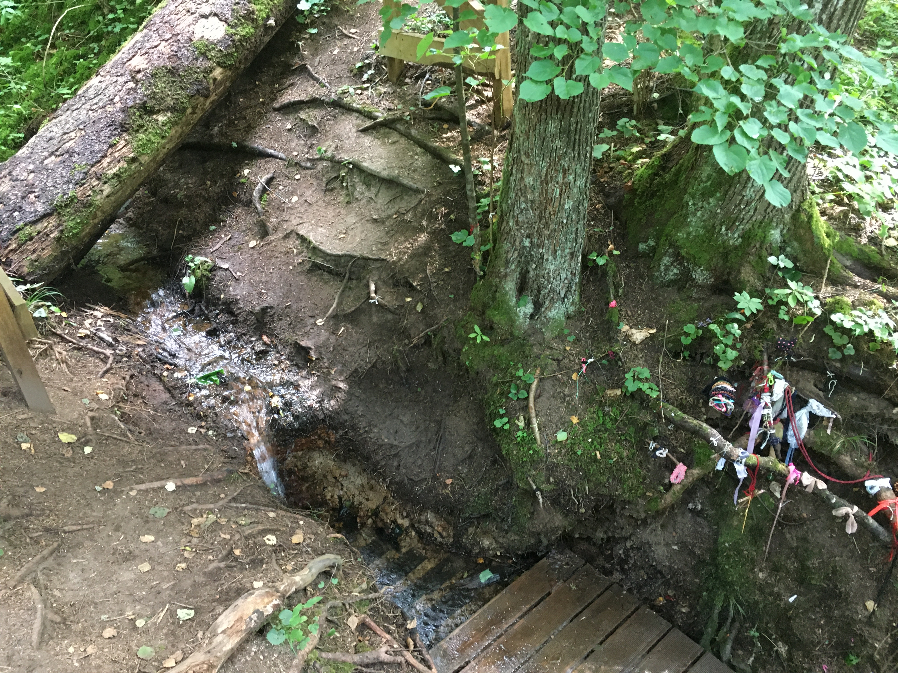
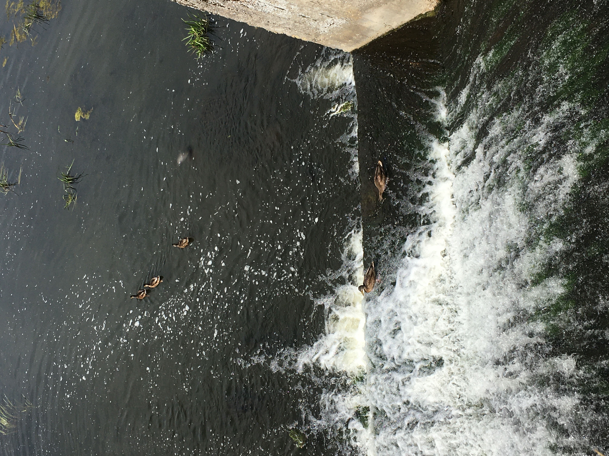
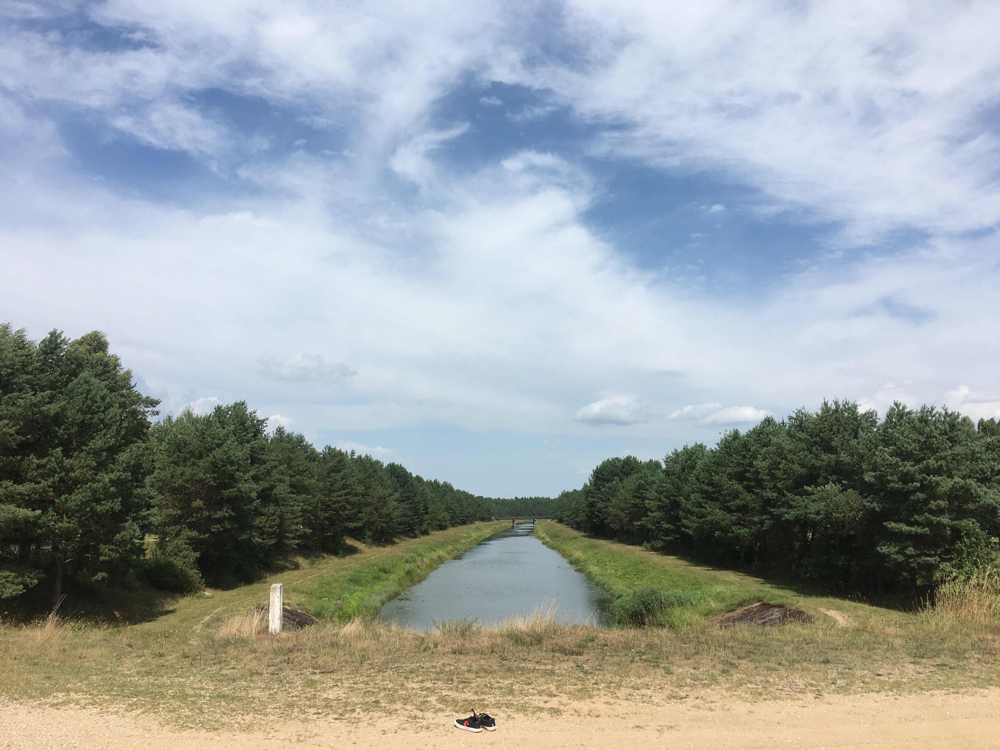
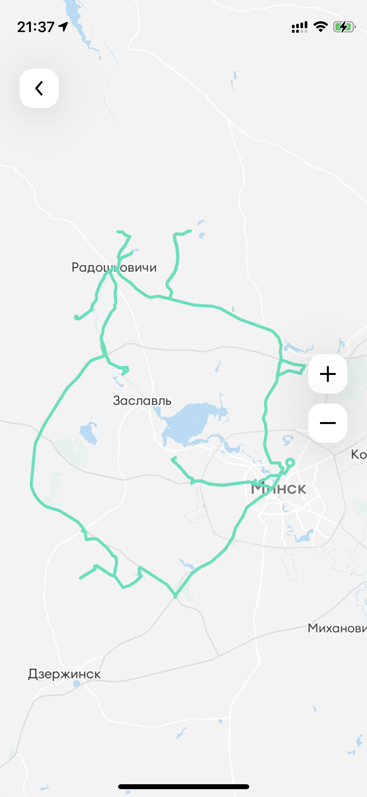
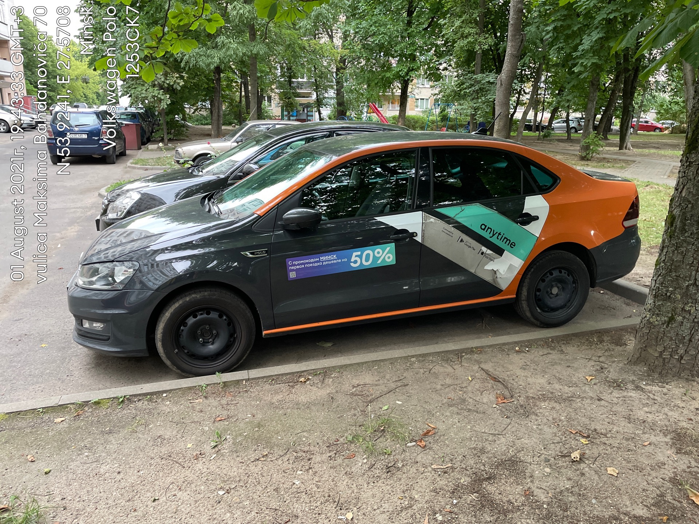

Once upon a time, I saw an
[article](https://realt.onliner.by/2021/06/12/20-krutyx-mest-dlya-progulok) at Onliner. And now,
more than a month later, I’m ready to look at places from that article.

I used the car sharing by [Anytime](https://any-time.by) as a transport. From the beginning, I
blunted that the car starts only after the start of the sharing (support explained everything). On
the way, I saw a white stork’s nest with chicks.

The first point of the way was the ‘Holy Krinitsy’. I have already traveled here on a bike (where I
made figure‐eight on the back wheel and bent the derailleur hanger) but the trip was much nicer on
the car ~~whoever doubted~~. It is quiet, calm in the krinitsy, but everything is spoiled by human
garbage and fallen trees that blocked the trail. The water tastes like iron.

The second point is the ‘Udranka Reservoir’. Its area is rather small, but it was enough to swim.
The dam was shitted with broken bottles.

Number three – ‘Hydropark of the sanatorium “Sosnovy Bor”’. And here is even some kind of
infrastructure: boat rental, islands with barbecues and gazebos. Gazebos, by the way, are free for
the clients of the sanatorium and paid for everyone else. But, as usual in Belarus, if you want to
pay – ~~fuck off~~ you won’t find where. Most of all the joy is delivered by the suspension bridges
and ducks.

Four – ‘Ballast quarry’ near Vyazynka. I arrived but did not get through the checkpoint. WELL…

Number five – ‘Rapid flow at Zaslavl’. The path ends with a very long lousy dirt road. But then you
can see the rapid flows and the animals that live here: a lot of frogs that jump out under your
feet, and some small fish.

6 – ‘Yutskovsky Springs’. Almost the same as number one, but the water is much more pleasant:
without metal in taste, slightly sweet. And there are many more points for collecting water. And
also the atmosphere is much mysterious – a ravine, coolness, a trail among overhanging trees…

And that was enough for the whole day.

In general, I found something to fill my weekends with ~~not, all the same, to sit at the
computer~~. What surprised me that I enjoyed driving, especially on the highway. Very relaxing
(almost like ETS2), but it’s dangerous at a speed of 120 km/h. I have not driven for about 10 years
~~I have not driven at all, except for the exam~~, but after a day of driving, I got used to it
(however, I had to use traffic rules app for a week to refresh my knowledge). Car rent impressions
are spoiled by the coherence with the mobile application, such that without the Internet the car
cannot be closed or opened. I had to call support for solving this near the “Krinitsy”. And the app
works strangely with 3G Internet – does not work at all. ~~I haven’t read it, but~~ I condemn.

As a result, in a day I drove off 266 km and spent half a gas tank. I spent ≈$42 (105.34 BYN) on
everything. I planned to visit other places.

And I was also surprised that I was able to park the car reversed normally from the first time. I
didn’t expect it from myself.

