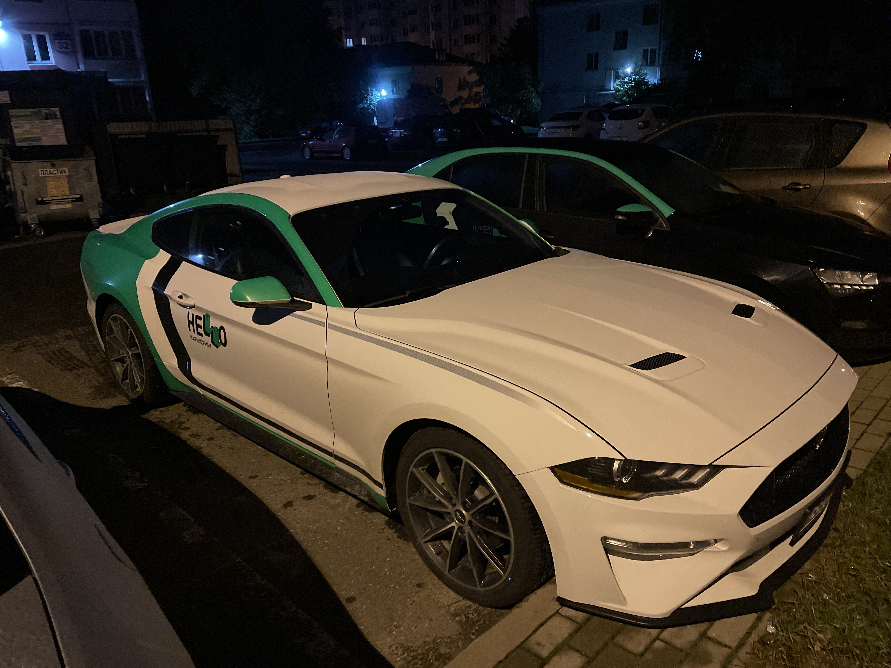

So I drove the Mustang.

To be honest, I expected more. And so only acceleration and… that’s it. I think the reasons for the bad experience, the
city, and the speed limits. It’s still dangerous to drive such a car around the city.

Update: I traveled for the second time, more freely, on the highway. And then I realized what the kaif was. Fast, power
reserve for fast overtaking, but the most important thing, of course, is the external beauty, although you don’t see it
when you drive.
