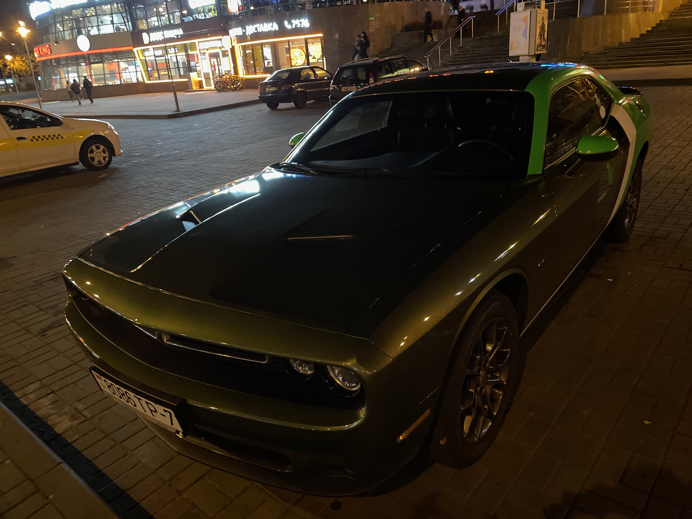

Попробовал эту конфетку. Очень широкий автомобиль. Настолько, что постоянно приходилось смотреть в зеркала заднего вида.
И внешний вид. Машина очень красива и агрессивна. Но Мустанг для меня лучше: комфортнее, с более прикольным звуком
двигателя. «...3,5‐4 тыс оборотов выдают такую оду двигателям внутреннего сгорания и нефтепродуктам, что никакое
троллейбусное ускорение Tesla S не может компенсировать удовольствия от этого звука.» —
[alexmak](https://alexmak.net/2013/11/29/camaro-notes-p5)
