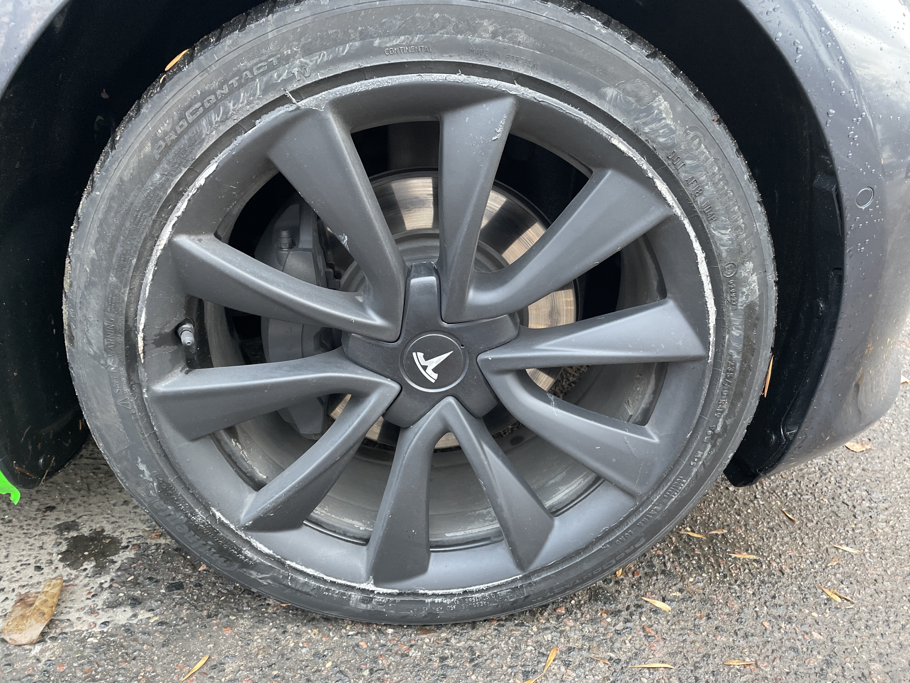

And now the Tesla Model 3. The acceleration, of course, is frantic. The autopilot was embarrassing to the point that I
crashed into the curb, but later about it. The comfort in the cabin is so simple: everything is normal. The biggest
impression is the silence: no engine sound, only the rustling of the wheels. In short, you should at least try to ride
on the Tesla, just to see, how can it be when it is so quiet and at the same time very FAST.

And now about the accident. I drove about 40, wanted a cruise, but turned on the autopilot, which, SUDDENLY, took the
car to the right to the curb, I turned the steering wheel to the left, and the autopilot again to the right. The result
is below.

Support [hello.by](https://hello.by) said to call the traffic police to record an accident, despite little consequences.

So it goes. The first Tesla trip coincided with the first road accident in my life. It was exciting.
