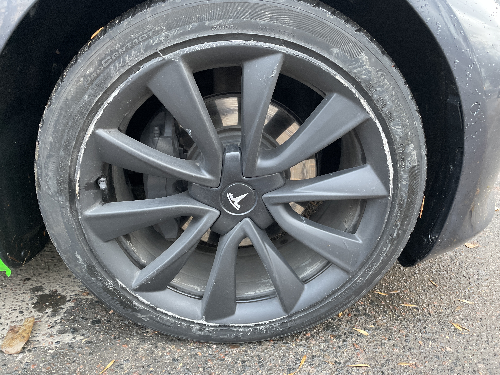

А теперь и Tesla Model 3. Ускорение, конечно, бешеное. Автопилот смутил до того, что аж врезался в
бордюр, но про это позже. Комфорт в салоне такой себе: всё обычное. Самое большое впечатление — это
тишина: никакого звука двигателя, только шелест колёс. Короче, на тесле стоит хотя бы попробовать
поездить, чисто позырить, как оно ещё может быть, когда тихо и при этом очень СТРЕМИТЕЛЬНО.

А теперь про ДТП. Ехал себе примерно 40, хотел круиз, а включил автопилот, который, ВНЕЗАПНО, повёл
машину вправо на бордюр, я выкрутил руль левее, а автопилот снова вправо. Итог ниже.

Поддержка [hello.by](https://hello.by) сказал вызвать ГАИ, чтобы зафиксировать ДТП, несмотря на,
казалось бы, мизерные последствия.

Такие дела. Первая поездка на Тесле совпала с первым в жизни ДТП. Было волнительно.
