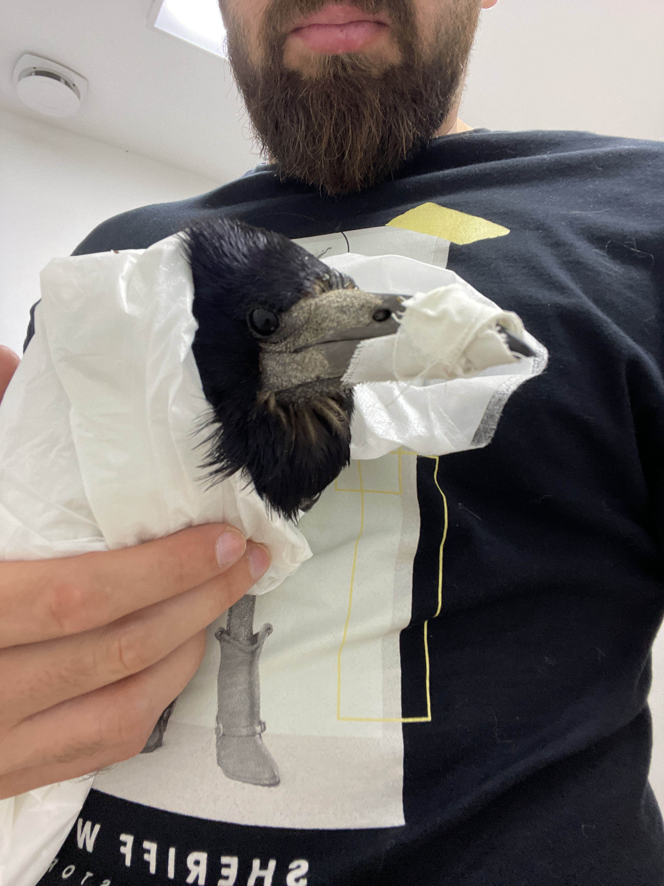

I had to euthanize two birds lately. Picked up both with injuries. And I couldn’t treat them.
Compared with the recent mobilization (gravilization?), this somehow pales. But I still remember how
I didn’t care to myself when the swift was injected with the last two injections.

One shot - paralyze.

The second is to kill.

Goodbye.
